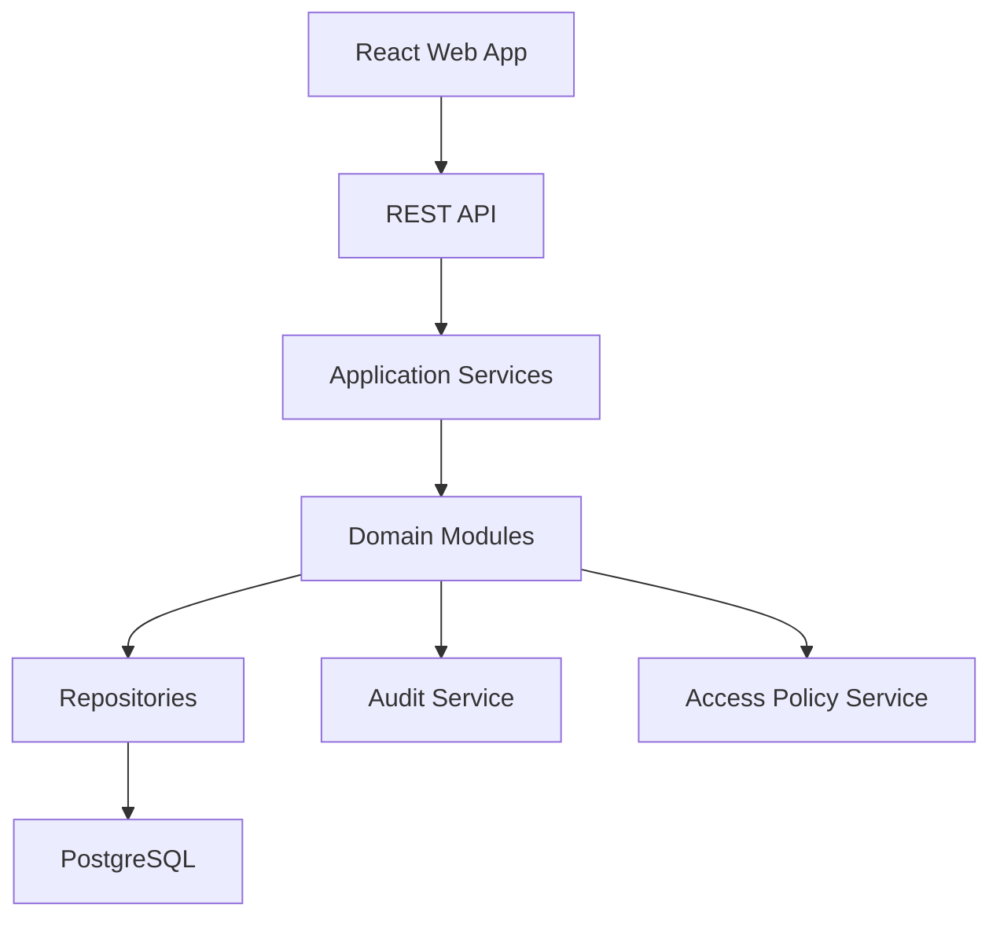
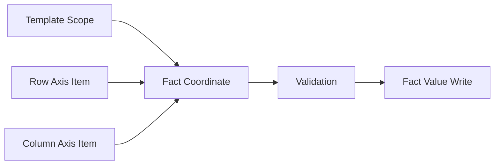

# ARCH-001: Technical Architecture Baseline

阶段编号：ARCH-001

生成日期：2026-05-06

本文件定义 Web Native 企业级全面预算管理平台的技术架构基线。本文只写架构设计，不创建后端或前端工程，不新增 migration，不写业务代码。

## 1. 架构结论

本项目采用 Web Native、模块化单体优先、关系数据库强一致建模的架构路线。

基线选择：

1. 后端：Java 17 + Spring Boot 3.x + Maven。
2. 前端：React + TypeScript + Vite + pnpm。
3. 数据库：PostgreSQL 16。
4. 数据访问：Spring Data JPA 起步，复杂查询可在后续阶段引入 jOOQ 或 SQL Mapper。
5. 数据迁移：Flyway，在进入允许 migration 的阶段后启用。
6. 测试：后端 JUnit / Spring Boot Test；前端 type-check、lint、build 和组件测试。
7. 部署形态：MVP 先按单后端服务 + 单前端应用 + PostgreSQL 设计。

不进入架构基线：

1. Excel / Office 插件。
2. ERP 直连。
3. BI 图表平台。
4. 合并报表引擎。
5. 通用脚本语言或 Script Logic。
6. 复杂工作流引擎。

## 2. 架构原则

| 原则 | 说明 |
| --- | --- |
| Web Native First | 核心业务操作必须在 Web 应用内完成 |
| Modular Monolith First | MVP 用清晰模块边界降低分布式复杂度 |
| Metadata Driven | 模型、维度、成员、层级定义预算口径 |
| Fact Value Single Source | Budget、Actual、Forecast 写入同源事实数据 |
| Explicit State | 填报状态和导入状态分离且显式 |
| Explainable Access | 权限用角色、责任范围、数据范围解释 |
| Auditable Change | 配置、状态、导入、权限变更都进入审计 |
| Stage Discipline | 架构允许扩展，但实现不得越过当前阶段 |

## 3. 逻辑架构

后端分层：

1. API Layer：REST 接口、请求校验、认证上下文。
2. Application Layer：用例编排、事务边界、DTO 转换。
3. Domain Layer：领域对象、状态流转、权限策略、业务校验。
4. Infrastructure Layer：数据库访问、文件存储、导入解析、审计落库。

前端分层：

1. Pages：路由页面。
2. Features：业务功能模块。
3. Components：可复用 UI 组件。
4. Services：API 客户端和请求模型。
5. State：页面级状态，MVP 优先简单状态管理。

## 4. 领域模块边界

| 模块 | 职责 | MVP 顺序 |
| --- | --- | --- |
| Governance | 项目规则、阶段记录、基础异常和审计约定 | BUD-001 |
| Metadata | 维度、成员、层级、Category、Version | BUD-002 至 BUD-004 |
| Budget Model | 模型定义、模型维度绑定、启停 | BUD-005 |
| Template | Web 填报模板、轴定义、单元格绑定、校验 | BUD-006 |
| Submission | 填报任务、草稿、提交、退回、通过、锁定 | BUD-007 |
| Query | 查询视图、筛选、层级汇总、明细钻取 | BUD-008 |
| Import | 实际数导入、映射、转换、校验、预览、批次提交 | BUD-009 |
| Access | 用户、角色、责任范围、数据范围 | 横切，随模块最小实现 |
| Audit | 配置、状态、导入、权限变更日志 | 横切，随模块最小实现 |

## 5. 核心数据模型基线

### 5.1 元数据

核心对象：

1. `budget_workspace`
2. `budget_model`
3. `dimension`
4. `dimension_member`
5. `dimension_hierarchy`
6. `model_dimension`
7. `category`
8. `version`

设计约束：

1. 维度成员以稳定编码作为业务引用。
2. 成员名称可变，编码变更必须受控。
3. 层级先支持单主层级。
4. 停用成员保留历史查询能力。
5. 模型启用后，维度集合变更必须审计。

### 5.2 同源事实数据

MVP 采用混合坐标模型：

1. `fact_value` 保存事实主记录、数值、来源、状态、批次、审计字段。
2. 核心维度坐标作为显式列：Account、Entity、Time、Category、Version。
3. 自定义维度坐标用 `fact_value_axis` 保存，支持模型动态维度。
4. `coordinate_hash` 用于同一模型、同一坐标的幂等写入和重复校验。

逻辑粒度：

| 字段 | 说明 |
| --- | --- |
| model_id | 所属预算模型 |
| account_member_id | 科目或指标 |
| entity_member_id | 组织或责任中心 |
| time_member_id | 期间 |
| category_member_id | Actual / Budget / Forecast |
| version_member_id | 版本 |
| coordinate_hash | 全维度坐标哈希 |
| amount | 数值 |
| source_type | MANUAL / IMPORT / ADJUSTMENT |
| source_ref_id | 填报任务或导入批次 |
| submission_status | 预算填报状态，仅手工填报相关 |
| import_batch_id | 导入批次，仅导入相关 |

关键取舍：

1. Budget、Actual、Forecast 不拆成不同事实表。
2. 模板不生成事实表。
3. 报表不保存事实数据。
4. 汇总由查询服务基于层级计算。

### 5.3 状态模型

填报状态：

1. `NOT_STARTED`
2. `DRAFT`
3. `SUBMITTED`
4. `RETURNED`
5. `APPROVED`
6. `LOCKED`

导入批次状态：

1. `UPLOADED`
2. `PARSED`
3. `MAPPED`
4. `VALIDATED`
5. `PREVIEWED`
6. `COMMITTED`
7. `FAILED`
8. `CANCELLED`

状态原则：

1. 填报状态控制人工预算流程。
2. 导入状态控制文件导入流程。
3. 两者不混用。
4. 状态变更必须写审计。

## 6. 模板与查询架构

模板对象：

1. `input_template`
2. `template_axis`
3. `template_axis_item`
4. `template_scope`
5. `template_cell_rule`

模板单元格解析流程：

查询对象：

1. `query_view`
2. `query_axis`
3. `query_filter`
4. `query_result`

查询原则：

1. 查询读取 `fact_value`。
2. 查询按 Data Scope 过滤。
3. 汇总按 `dimension_hierarchy` 计算。
4. MVP 不做 BI 图表。

## 7. 权限与审计架构

权限对象：

1. `user_account`
2. `role`
3. `permission`
4. `role_permission`
5. `responsibility_scope`
6. `data_scope`

权限校验顺序：

1. 用户是否具备功能权限。
2. 用户是否具备目标数据范围。
3. 操作状态是否允许。
4. 操作是否需要管理员例外。

审计对象：

1. `audit_log`
2. `audit_subject`
3. `audit_change`

审计事件范围：

1. 元数据配置变更。
2. 模型启停和维度绑定变更。
3. 模板配置变更。
4. 填报状态变更。
5. 导入批次状态变更。
6. 权限和责任范围变更。

## 8. 导入架构

导入流程：

导入约束：

1. 上传成功不等于导入成功。
2. 校验通过前不得写入正式事实数据。
3. 错误行不进入正式查询口径。
4. 导入批次可审计。
5. ERP 直连后置。

## 9. API 风格基线

1. 使用 REST API。
2. JSON 请求和响应。
3. 统一错误响应。
4. 分页、排序、筛选采用一致参数。
5. 所有写操作返回审计相关标识或状态。
6. 导入和长任务后续可引入异步任务状态 API。

## 10. 测试基线

后端阶段测试命令：

1. `mvn clean compile`
2. `mvn test`

前端阶段测试命令：

1. `pnpm type-check`
2. `pnpm lint`
3. `pnpm build`

文档阶段验证：

1. `git status --short`
2. `git check-ignore` 确认 PDF 和 OCR 缓存不入 Git。
3. 禁止范围检查：`backend/src`、`frontend/src`、migration。

## 11. ADR 清单

本阶段新增 ADR：

1. `docs/adr/0001-technology-stack.md`
2. `docs/adr/0002-web-native-no-excel-plugin.md`
3. `docs/adr/0003-single-source-fact-value.md`

后续建议 ADR：

1. 动态维度物理模型。
2. 权限与数据范围过滤策略。
3. 导入批次撤销或冲销策略。
4. 审计日志存储策略。

## 12. 风险与后续决策

| 风险 | 后续处理 |
| --- | --- |
| 动态维度查询性能 | BUD-002 设计索引和坐标哈希策略 |
| JPA 对复杂查询表达不足 | BUD-008 前评估是否引入 jOOQ |
| 权限过滤遗漏 | Access Policy Service 作为统一入口 |
| 审计散落 | Audit Service 作为横切服务 |
| 导入覆盖历史数据 | BUD-009 前确定覆盖、冲销或版本化策略 |

## 13. 是否建议进入下一阶段

建议关闭 ARCH-001 后进入 PRODUCT-001。

理由：架构基线已明确技术栈、分层架构、同源事实数据、状态、权限、审计和导入设计边界。PRODUCT-001 应把这些架构约束转成 MVP 用户流程、功能范围和验收标准。
