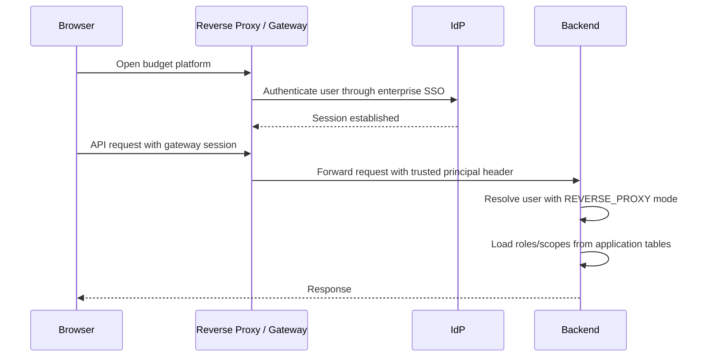

# AUTH-010 Frontend Bearer Boundary Decision

## Stage Goal

AUTH-010 decides whether the React browser frontend should implement a direct bearer-token flow after the backend JWT adapter is available.

Decision for the MVP: do not implement direct browser bearer token handling. Browser production traffic should continue to use a trusted reverse proxy or gateway session boundary that resolves the user before requests reach the backend. The backend JWT adapter remains available for gateway-to-backend, API-client, or service-client scenarios.

This stage is documentation only. It does not modify frontend runtime code, does not add login/logout UI, does not add token storage, does not add IdP SDKs, and does not change backend behavior.

## Decision

| Topic | Decision |
| --- | --- |
| Browser production auth route | Prefer `REVERSE_PROXY` trusted principal |
| Direct browser bearer flow | Not in MVP |
| Frontend `Authorization` injection | Not implemented |
| Token storage | Do not use `localStorage` or `sessionStorage` |
| Refresh tokens | Do not store in JavaScript-accessible storage |
| JWT backend adapter usage | API/gateway/service clients, or controlled gateway-to-backend calls |
| Budget authorization | Still application-owned roles and Entity scopes |

## Rationale

The current application is an enterprise web platform, not a public SPA-first identity product. The safer MVP path is to keep the browser out of token lifecycle management and put identity session handling at the gateway or reverse proxy layer.

This avoids:

1. Long-lived tokens in browser storage.
2. Premature refresh-token rotation design.
3. CORS and cookie policy drift before deployment topology is fixed.
4. IdP-specific frontend SDK lock-in.
5. Confusing IdP group/scope claims with application budget authorization.

## Accepted Production Browser Flow

Backend route:

1. `budget-platform.auth.mode=REVERSE_PROXY`
2. `budget-platform.auth.reverse-proxy-user-header` set to a gateway-controlled header.
3. Gateway strips spoofed client identity headers.
4. Browser never writes `X-User-Id`, `X-User-Roles`, or `Authorization` in production builds.

## Accepted JWT Usage

JWT mode is appropriate when a trusted caller can manage bearer tokens outside the browser JavaScript runtime.

Examples:

1. API gateway calling the backend with a validated or re-issued service token.
2. Non-browser API clients.
3. Automation clients with managed credentials.
4. Future backend-to-backend integration once explicitly scoped.

JWT route:

1. `budget-platform.auth.mode=JWT`
2. Configure issuer, audience, JWKS URI, username claim, clock skew, max token length, and allowed algorithms.
3. Pre-provision application users and role/scope grants.
4. Keep IdP group/scope claims out of budget authorization.

## Rejected MVP Browser Patterns

| Pattern | Reason |
| --- | --- |
| Store access token in `localStorage` | Exposes bearer token to XSS and persistent browser compromise |
| Store access token in `sessionStorage` | Still JavaScript-accessible and adds brittle tab/session behavior |
| Store refresh token in browser JavaScript | High blast radius and requires mature rotation/revocation design |
| Use IdP group claims as roles | Breaks application-owned budget authorization model |
| Add IdP SDK before topology is fixed | Couples MVP to a provider-specific login flow too early |

## Future Direct Bearer Preconditions

If a future stage explicitly requires direct browser bearer flow, it must first produce a dedicated design covering:

1. OIDC Authorization Code + PKCE flow.
2. Access token kept in memory only, or a BFF/session-cookie pattern.
3. Refresh token never exposed to JavaScript.
4. Secure, HttpOnly, SameSite cookie policy if a BFF pattern is used.
5. CSRF and CORS controls.
6. Logout/session revocation.
7. Token renewal failure behavior.
8. E2E browser smoke tests.
9. Threat model for XSS, token replay, and audit leakage.
10. Explicit rollback plan to `REVERSE_PROXY`.

## Frontend Contract For Now

1. Production frontend does not inject internal identity headers.
2. Production frontend does not inject `Authorization`.
3. Development identity selector remains dev-only.
4. `/api/security/me` remains the frontend source of displayable current-user state.
5. Frontend displays backend-resolved auth mode and grants; it does not assert production roles.

## Validation

This documentation stage does not require backend or frontend build execution because no runtime code changed.

Repository checks:

1. `git check-ignore` confirms PDF, OCR, build, and dependency outputs remain ignored.
2. `git diff --check` confirms no whitespace errors.
3. Boundary scan confirms no new frontend token storage, ERP, BI, consolidation, PDF, or OCR code.

## Next Stage

The next recommended stage is `AUTH-011`: deployment smoke and rollback playbook for `REVERSE_PROXY` and `JWT` auth modes. That stage should document concrete environment variables, smoke commands, expected HTTP results, audit checks, and rollback steps without committing secrets.

## Close Recommendation

Close AUTH-010 when this decision document, README update, stage record, repository checks, and boundary scan are complete, with no frontend token code, secrets, migration, external IdP SDK, PDF/OCR source, ERP, BI, or consolidation scope introduced.
