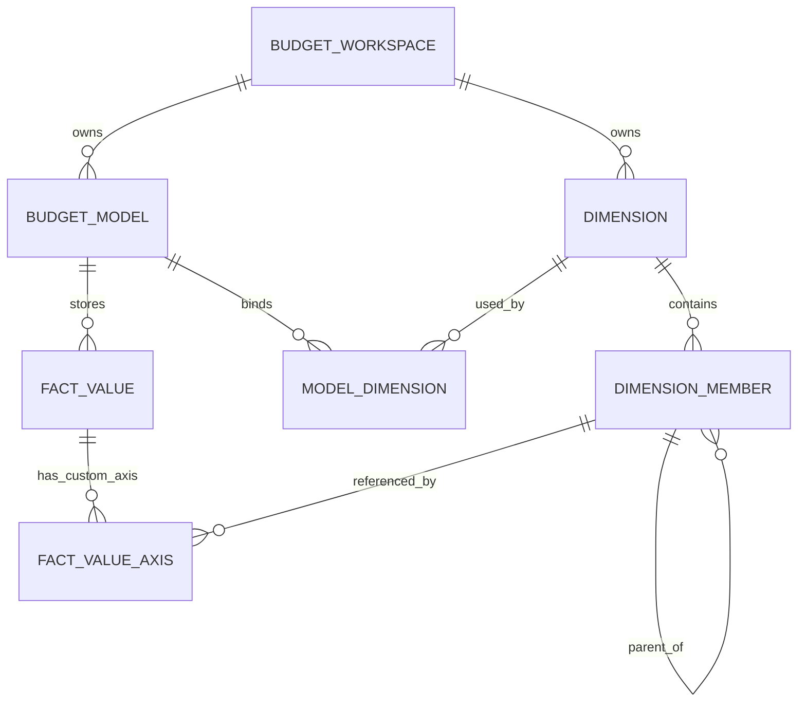

# BUD-002: Metadata Model Design

阶段编号：BUD-002

生成日期：2026-05-06

本文件定义全面预算平台 MVP 的元数据逻辑模型和物理模型候选。本阶段只做设计，不创建 migration，不新增数据库表，不实现元数据 API 或前端页面。

## 1. 设计结论

MVP 元数据采用“预算空间 + 模型 + 维度 + 成员 + 单主层级 + Category + Version + 同源事实坐标”的结构。

核心结论：

1. Account、Entity、Time、Category、Version 是 MVP 强制内置维度类型。
2. Dimension 是可复用主数据，Budget Model 通过 Model Dimension 绑定维度集合。
3. Member 使用稳定编码作为事实数据引用，名称和属性可变。
4. Hierarchy 先支持单主父子层级，不支持多父、多层级版本和共享节点。
5. Fact Value 使用核心维度显式列 + 自定义维度轴表的混合坐标模型。
6. Category 与 Version 作为维度参与事实坐标，但可在 UI 中以系统对象呈现。
7. 权限 Data Scope 暂只设计引用关系，具体授权计算后置。

## 2. 输入来源

| 来源 | 用途 |
| --- | --- |
| `docs/product/bpc-kb-002-model-dimension.md` | 模型、维度、成员、层级设计约束 |
| `docs/product/product-001-mvp-scope.md` | MVP 费用预算场景和默认维度集合 |
| `docs/architecture/arch-001-technical-baseline.md` | 同源事实数据、模块边界、状态审计基线 |
| `docs/adr/0003-single-source-fact-value.md` | Budget / Actual / Forecast 同源事实数据决策 |

## 3. 逻辑模型

## 4. 对象设计

### 4.1 budget_workspace

| 字段 | 说明 | 约束 |
| --- | --- | --- |
| id | 技术主键 | UUID |
| code | 预算空间编码 | 唯一、稳定 |
| name | 名称 | 可变 |
| status | ACTIVE / INACTIVE | 默认 ACTIVE |
| created_at / updated_at | 审计时间 | 必需 |

用途：承载同一企业或租户下的模型、维度和权限边界。MVP 可以只有一个 workspace，但仍保留字段避免后续返工。

### 4.2 dimension

| 字段 | 说明 | 约束 |
| --- | --- | --- |
| id | 技术主键 | UUID |
| workspace_id | 所属预算空间 | 必需 |
| code | 维度编码 | 同 workspace 唯一 |
| name | 维度名称 | 可变 |
| dimension_type | ACCOUNT / ENTITY / TIME / CATEGORY / VERSION / CUSTOM | 必需 |
| is_system | 是否系统维度 | 系统维度受保护 |
| status | ACTIVE / INACTIVE | 默认 ACTIVE |
| attributes_schema | 轻量属性定义 | JSONB 候选 |

设计原则：

1. 系统维度不可删除。
2. 同一类型可存在多个维度，但一个模型每种核心类型只能绑定一个。
3. `attributes_schema` 只定义轻量展示和校验，不做脚本逻辑。

### 4.3 dimension_member

| 字段 | 说明 | 约束 |
| --- | --- | --- |
| id | 技术主键 | UUID |
| dimension_id | 所属维度 | 必需 |
| code | 成员编码 | 同维度唯一，事实引用稳定 |
| name | 成员名称 | 可变 |
| parent_id | 单主层级父节点 | 可空 |
| sort_order | 同级排序 | 可空 |
| is_leaf | 是否叶子 | 可计算或冗余 |
| status | ACTIVE / INACTIVE | 停用保留历史 |
| attributes | 成员属性 | JSONB 候选 |

设计原则：

1. 成员编码一经被事实数据引用，不允许静默修改。
2. 停用成员不可用于新填报和新导入，但可查询历史。
3. 父子关系不允许循环。
4. MVP 不支持一个成员属于多个父节点。

### 4.4 budget_model

| 字段 | 说明 | 约束 |
| --- | --- | --- |
| id | 技术主键 | UUID |
| workspace_id | 所属预算空间 | 必需 |
| code | 模型编码 | 同 workspace 唯一 |
| name | 模型名称 | 可变 |
| model_type | EXPENSE_BUDGET / GENERIC_BUDGET | MVP 默认 EXPENSE_BUDGET |
| status | DRAFT / ACTIVE / INACTIVE | 启用后变更受审计 |
| fiscal_calendar_code | 财年日历编码 | MVP 可简化 |

设计原则：

1. 启用模型必须绑定 Account、Entity、Time、Category、Version。
2. 模型绑定维度后，模板、填报、查询和导入共享同一口径。
3. 模型停用不删除历史事实数据。

### 4.5 model_dimension

| 字段 | 说明 | 约束 |
| --- | --- | --- |
| id | 技术主键 | UUID |
| model_id | 预算模型 | 必需 |
| dimension_id | 维度 | 必需 |
| role | ACCOUNT / ENTITY / TIME / CATEGORY / VERSION / CUSTOM | 必需 |
| required | 是否必需 | 核心维度必需 |
| axis_order | 坐标排序 | 用于坐标 hash |

设计原则：

1. 同一模型内 `role` + `dimension_id` 不重复。
2. 同一模型核心 role 只能有一个维度。
3. `axis_order` 固定后参与 `coordinate_hash` 计算。

### 4.6 fact_value

| 字段 | 说明 | 约束 |
| --- | --- | --- |
| id | 技术主键 | UUID |
| model_id | 所属模型 | 必需 |
| account_member_id | Account 成员 | 必需 |
| entity_member_id | Entity 成员 | 必需 |
| time_member_id | Time 成员 | 必需 |
| category_member_id | Category 成员 | 必需 |
| version_member_id | Version 成员 | 必需 |
| coordinate_hash | 完整坐标 hash | 同模型唯一候选 |
| amount | 数值 | decimal |
| source_type | MANUAL / IMPORT / ADJUSTMENT | 必需 |
| source_ref_id | 填报任务或导入批次 | 可空 |
| status | DRAFT / SUBMITTED / APPROVED / LOCKED / COMMITTED | 按来源解释 |

设计原则：

1. Budget、Actual、Forecast 不拆事实表。
2. 核心维度显式列用于常见查询和索引。
3. 自定义维度写入 `fact_value_axis`。
4. 导入覆盖、冲销或版本化策略在 BUD-009 前另定。

### 4.7 fact_value_axis

| 字段 | 说明 | 约束 |
| --- | --- | --- |
| id | 技术主键 | UUID |
| fact_value_id | 事实值 | 必需 |
| dimension_id | 自定义维度 | 必需 |
| member_id | 维度成员 | 必需 |
| axis_order | 坐标排序 | 与 model_dimension 对齐 |

设计原则：

1. 只保存自定义维度坐标，不重复保存核心维度。
2. 同一 fact_value 下同一 dimension 只能出现一次。
3. 与 `coordinate_hash` 一起保证动态维度幂等写入。

## 5. 系统维度初始化建议

MVP 初始化以下系统维度和成员：

| 维度 | 初始成员 |
| --- | --- |
| Category | Actual、Budget、Forecast |
| Version | Working、Approved、Final |
| Time | 由 BUD-003 或初始化脚本按财年生成，设计阶段不落库 |

Account 和 Entity 由用户维护或后续导入，不在设计阶段写入数据。

## 6. 校验规则

| 场景 | 校验 |
| --- | --- |
| 创建维度 | workspace 内 code 唯一，dimension_type 合法 |
| 创建成员 | dimension 内 code 唯一，parent_id 属于同一 dimension |
| 调整父节点 | 不允许循环，不允许跨维度父节点 |
| 停用成员 | 如果存在事实引用，允许停用但不可删除 |
| 启用模型 | 必须绑定 Account、Entity、Time、Category、Version |
| 绑定维度 | 核心 role 不可重复，自定义维度可多个 |
| 写入事实 | 坐标必须满足 model_dimension，成员必须 ACTIVE 或允许历史写入 |
| 查询汇总 | 只按当前主层级计算，历史层级版本后置 |

## 7. 索引候选

本阶段不创建索引，只记录候选：

1. `dimension(workspace_id, code)`
2. `dimension_member(dimension_id, code)`
3. `dimension_member(dimension_id, parent_id)`
4. `budget_model(workspace_id, code)`
5. `model_dimension(model_id, role)`
6. `fact_value(model_id, coordinate_hash)`
7. `fact_value(model_id, category_member_id, version_member_id, time_member_id)`
8. `fact_value(model_id, entity_member_id, account_member_id)`
9. `fact_value_axis(dimension_id, member_id)`

## 8. 权限范围预留

Data Scope 后续可引用：

1. workspace_id
2. model_id
3. dimension_id
4. member_id
5. include_descendants

MVP 权限过滤应通过统一 Access Policy Service 实现，不让各业务模块手写权限条件。

## 9. ADR

本阶段新增 ADR：

1. `docs/adr/0004-dynamic-dimension-physical-model.md`
2. `docs/adr/0005-single-primary-hierarchy.md`

## 10. 非目标

本阶段不做：

1. migration。
2. JPA Entity。
3. Repository。
4. Controller。
5. 前端元数据页面。
6. 成员导入。
7. 权限实现。

## 11. 下一阶段

建议进入 BUD-003：元数据后端。

BUD-003 应按本设计实现最小后端 API，并在进入时明确是否允许新增 migration。
