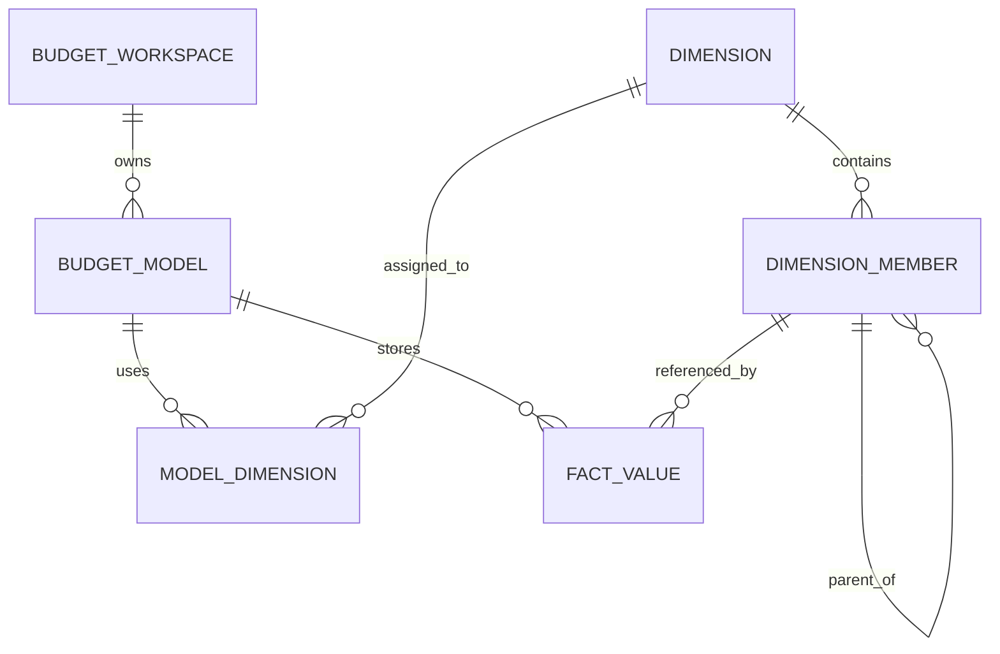

# BPC-KB-002: Model, Dimension, Member, Hierarchy

阶段编号：BPC-KB-002

生成日期：2026-05-06

本文件抽取 SAP BPC 中模型、维度、成员、层级的产品思想，并转换为自研预算平台的元数据设计约束。内容基于全量 OCR 缓存和页码定位，只保留结构化摘要，不复制 PDF 原文或 OCR 全文。

## 1. 本阶段结论

自研预算平台必须以“模型 + 维度 + 成员 + 层级”为预算元数据核心：

1. 模型定义业务域和数据粒度。
2. 维度定义数据口径。
3. 成员定义维度取值。
4. 层级定义汇总关系。
5. 事实数据只引用模型、维度成员、类别、版本和期间，不把口径写死在模板中。

MVP 的最小闭环应先支持：

1. 一个预算空间下多个预算模型。
2. 预算模型绑定维度集合。
3. 维度支持类型、编码、名称、属性。
4. 成员支持父子层级、排序、启停。
5. 事实数据按模型和维度成员组合存储。

## 2. 来源定位

| 主题 | 主要来源 |
| --- | --- |
| Model | BPC420 p19-p22；BPC440 p10-p17；BPC450 p13-p14；S4F80 p11-p19；s4f90 p20-p21，OCR |
| Dimension | BPC420 p19-p22；BPC430 p16-p21；BPC440 p16-p17；BPC450 p31, p42；s4f90 p20-p34，OCR |
| Member | BPC420 p20-p22, p31；BPC430 p5-p21；BPC440 p18, p26-p28；BPC450 p83-p109，OCR |
| Hierarchy | BPC420 p20-p22, p56-p57；BPC430 p47, p67；BPC440 p28, p36-p38；BPC450 p110-p127，OCR |
| Category / Version | BPC420 p37, p50, p55-p56；BPC440 p25-p39；S4F80 p41-p44，OCR |
| Account / Entity / Time | BPC420 p19-p20, p30-p31, p37；BPC440 p16-p18；S4F80 p96，OCR |

## 3. BPC 思想抽取

### 3.1 Model

BPC 中 Model 是一组业务用途、维度集合和数据处理规则的容器。不同模型可以服务计划、报表、合并等不同场景。

对自研平台的启示：

1. 预算模型不是数据库表名，而是业务模型定义。
2. 模型应声明它使用哪些维度。
3. 模型应声明数据类别、版本和期间是否参与事实数据。
4. 模型应有状态：草稿、启用、停用。
5. 模型应有可审计的配置版本，避免直接改动导致历史数据口径漂移。

MVP 取舍：只做预算模型，不做合并模型；保留模型类型字段以支持未来扩展。

### 3.2 Dimension

BPC 中 Dimension 是多维数据的口径轴。常见维度包括 Account、Entity、Time、Category，也可配置自定义维度。

对自研平台的启示：

1. 维度必须主数据化，不能散落在模板字段里。
2. 维度应有类型，用于约束业务语义。
3. 维度属性应支持成员校验、展示、过滤和后续权限。
4. 同一个维度可被多个模型复用。
5. 维度变更应独立于事实数据，但必须保留历史引用的稳定编码。

MVP 取舍：先支持系统维度和自定义维度，维度属性先做键值配置，不做复杂属性类型系统。

### 3.3 Member

BPC 中 Member 是维度的具体取值。成员通常包含编码、描述、属性和父子关系。

对自研平台的启示：

1. 成员编码必须稳定，不能以名称作为事实数据引用。
2. 成员名称可变，编码不可轻易变。
3. 成员应支持启停，停用成员不应影响历史事实查询。
4. 成员属性用于模板筛选、报表展示和导入校验。
5. 成员维护需要导入能力，但导入过程必须透明可审计。

MVP 取舍：先支持单维度成员维护、批量导入和基础属性，不做复杂跨维引用。

### 3.4 Hierarchy

BPC 中 Hierarchy 表达成员父子关系，用于汇总、报表导航和数据访问口径。

对自研平台的启示：

1. 层级是汇总规则，不是模板里的手工合计行。
2. 层级需要支持父子关系、排序、叶子节点判断。
3. 事实数据原则上写入叶子成员，汇总由层级计算产生。
4. 层级调整应可追踪，避免历史汇总口径无法解释。
5. 权限可以参考层级，但 MVP 不应把权限完全绑定到复杂层级矩阵。

MVP 取舍：先支持每个维度一个主层级；多层级、共享节点、复杂权限继承后置。

## 4. 自研元模型建议

建议元对象：

| 对象 | 说明 | MVP 必需 |
| --- | --- | --- |
| Budget Workspace | 预算空间，承载模型和配置边界 | 是 |
| Budget Model | 预算模型，定义数据域和维度组合 | 是 |
| Dimension | 维度定义 | 是 |
| Dimension Type | 维度类型，如 Account、Entity、Time、Category、Version、Custom | 是 |
| Dimension Member | 维度成员 | 是 |
| Member Hierarchy | 成员父子关系 | 是 |
| Model Dimension | 模型与维度绑定关系 | 是 |
| Fact Value | 预算/实际事实数据 | 后续开发阶段 |
| Dimension Attribute | 维度或成员属性 | 是，先轻量 |
| Model Version Config | 模型配置版本 | 中期 |

## 5. 维度类型建议

| 维度类型 | 用途 | MVP 处理 |
| --- | --- | --- |
| Account | 指标、科目、预算项目 | 必需 |
| Entity | 组织、部门、责任中心 | 必需 |
| Time | 年、季度、月等期间 | 必需 |
| Category | Actual、Budget、Forecast | 必需 |
| Version | 预算版本、预测版本、调整版本 | 必需 |
| Currency | 币种 | 可预留，MVP 可选 |
| Audit / Source | 来源、导入批次、调整来源 | 可预留 |
| Custom | 项目、产品、区域等自定义口径 | 必需 |

关键取舍：Category 与 Version 必须分开。Category 表示数据性质，Version 表示同一性质下的版本或场景。

## 6. 事实数据粒度建议

预算与实际同源事实数据建议采用如下逻辑粒度：

| 粒度字段 | 说明 |
| --- | --- |
| model_id | 所属预算模型 |
| account_member_id | 科目或指标 |
| entity_member_id | 组织或责任中心 |
| time_member_id | 期间 |
| category_member_id | Actual / Budget / Forecast |
| version_member_id | 版本 |
| custom_dimension_members | 其他模型维度成员 |
| amount | 数值 |
| source_type | 手工填报、导入、调整 |
| source_batch_id | 导入批次或填报批次 |

MVP 注意事项：

1. 事实表不应为每个模板生成一张表。
2. 事实表不应把预算和实际拆成完全不同结构。
3. 模型维度集合应约束事实数据必须提供哪些维度成员。
4. 层级汇总应在查询层或汇总服务中完成，不手工写入合计行作为唯一来源。

## 7. 校验规则建议

| 校验点 | 规则 |
| --- | --- |
| 模型绑定维度 | 一个启用模型必须绑定 Account、Entity、Time、Category、Version 等基础维度 |
| 成员编码 | 同一维度内唯一 |
| 成员层级 | 不允许循环父子关系 |
| 成员状态 | 停用成员不可用于新填报，但历史数据可查询 |
| 事实数据 | 必须满足模型维度集合，不允许缺少必需维度 |
| 模板 | 模板引用的维度和成员必须属于对应模型 |
| 导入 | 导入文件成员编码必须能映射到有效成员 |

## 8. 规避原则

1. 不照搬 BPC 的多模型复杂场景，MVP 只做预算主线模型。
2. 不把维度权限、Work Status、模板锁定一次性绑定成复杂矩阵。
3. 不用 Excel 单元格结构定义数据模型。
4. 不用脚本逻辑动态改变模型结构。
5. 不在早期支持复杂多层级、多父节点、合并专用维度。
6. 不把合并模型带入预算 MVP。

## 9. 后续阶段输入

BPC-KB-003 可基于本阶段结论展开模板/Input Schedule：

1. 模板必须绑定预算模型。
2. 模板行列轴应引用维度和成员。
3. 模板填报数据应落入统一事实数据。
4. 模板不应成为事实数据结构。

BPC-KB-004 可基于本阶段结论展开 Work Status：

1. 状态锁定范围应使用模型、版本、期间、组织等清晰维度。
2. MVP 只做可解释的填报状态，不做复杂切片锁定矩阵。

## 10. 待复核问题

1. OCR 页码需要在后续关键设计前抽样复核。
2. BPC Embedded 与 Standard 在模型语义上存在差异，ARCH-001 需要选择更适合 Web Native 自研平台的抽象。
3. Category/Version 的最终字段关系需要在 BPC-KB-009 和 ARCH-001 再定稿。
4. 是否引入 Audit/Source 维度应结合实际数导入阶段确定。
