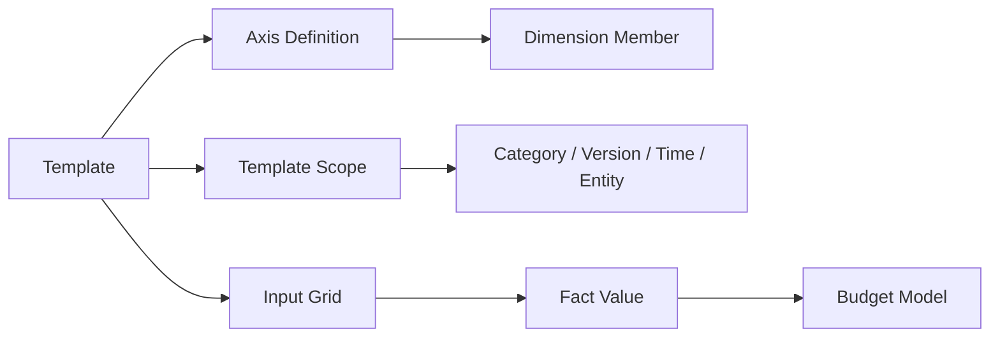

# BPC-KB-003: Template And Input Schedule

阶段编号：BPC-KB-003

生成日期：2026-05-06

本文件抽取 SAP BPC 中模板、Input Schedule、Input Form 与报表输入体验的产品思想，并转换为自研 Web Native 预算填报模板设计原则。内容基于全量 OCR 缓存和页码定位，只保留结构化摘要，不复制 PDF 原文或 OCR 全文。

## 1. 本阶段结论

BPC 的 Input Schedule 本质上是“绑定模型与维度口径的数据输入视图”。它值得吸收的不是 Excel 插件形态，而是：

1. 模板绑定模型。
2. 行、列、筛选区域绑定维度和成员。
3. 用户在模板中录入数据。
4. 数据保存回模型事实数据。
5. 模板同时承担输入、校验、局部计算和基础展示。

自研平台必须 Web Native 化：

1. 模板不是 Excel 文件。
2. 模板不是数据库表。
3. 模板不保存事实数据结构。
4. 模板只是模型、维度、成员、版本、期间和表格布局的配置入口。

## 2. 来源定位

| 主题 | 主要来源 |
| --- | --- |
| Input Schedule | BPC420 p18, p32, p41, p51, p133；BPC430 p57, p82, p209；BPC440 p58, p138, p144；s4f90 p117，OCR |
| Template | BPC420 p41, p44, p48, p51, p73；BPC430 p96-p104, p120；BPC440 p17, p23, p47, p57；S4F80 p180-p185，OCR |
| Workbook / Worksheet | BPC420 p135-p150；BPC430 p16, p20, p22, p33, p43-p49；BPC450 p81-p83，OCR |
| Input Form / Data Input | BPC420 p132, p141, p155, p157；BPC430 p17, p19, p30-p31；BPC440 p16, p26-p29；S4F80 p165-p177，OCR |
| Save Data / Submit | BPC420 p142, p227, p292-p309；BPC450 p85, p146, p152；S4F80 p182-p183, p225，OCR |
| Member Recognition / Local Member | BPC420 p142, p244；BPC430 p43, p55-p56, p73, p94；BPC450 p121-p130，OCR |

## 3. BPC 思想抽取

### 3.1 模板是一种多维视图

Input Schedule 不应理解为“表格文件”，而应理解为“模型数据的输入视图”。它用行、列、页筛选等方式，把模型维度和成员组织成用户可理解的填报界面。

自研取舍：

1. 模板必须绑定预算模型。
2. 模板的行轴、列轴、筛选条件必须引用维度和成员。
3. 模板保存的是布局配置和填报规则，不是事实数据本身。
4. 事实数据写入统一事实表。

### 3.2 Excel 插件是形态，不是原则

BPC 的输入体验大量依赖 Workbook、Worksheet、EPM 插件、Member Recognition、Local Member 和格式控制。这些能力说明预算用户需要类似表格的工作方式，但不意味着自研平台必须复制 Excel 插件。

自研取舍：

1. 吸收表格化输入体验。
2. 规避 Excel 插件安装、版本兼容、宏、刷新和本地文件分发问题。
3. Web 端提供模板设计器、在线填报表格、权限与状态提示。
4. 导入/导出 Excel 只作为辅助，不作为主工作台。

### 3.3 模板需要保存与提交语义

BPC 中 Save Data、Submit、Data Input 等术语说明填报模板不只是展示，也涉及保存、提交、校验和状态推进。

自研取舍：

1. 保存表示草稿数据进入系统。
2. 提交表示用户确认某个组织、版本、期间、模板的数据。
3. 校验必须在保存或提交前执行。
4. 后续 Work Status 阶段再定义锁定与退回，不在模板阶段引入复杂审批。

### 3.4 模板需要成员识别和动态展开

BPC 中 Member Recognition、Local Member、Expansion 等机制用于识别表格中的维度成员和动态展开行列。

自研取舍：

1. Web 模板中不依赖用户手写成员名称。
2. 行列轴应由模板配置显式绑定维度成员或成员集合。
3. 动态展开应来自层级、筛选条件或成员集合，不来自公式魔法。
4. 本地计算行可以保留，但不能写回事实数据，除非有明确映射规则。

## 4. Web Native 模板对象建议

| 对象 | 说明 | MVP 必需 |
| --- | --- | --- |
| Template | 模板主对象，绑定预算模型、版本策略、状态 | 是 |
| Template Sheet | 模板页签或区域 | 可选，MVP 可先单页 |
| Axis Definition | 行轴、列轴、筛选轴定义 | 是 |
| Axis Item | 维度成员、成员集合、层级节点或计算行 | 是 |
| Cell Rule | 单元格可编辑、只读、必填、公式或校验规则 | 是 |
| Template Scope | 模板适用组织、期间、类别、版本 | 是 |
| Data Binding | 单元格到事实数据维度组合的绑定 | 是 |
| Validation Rule | 保存/提交前校验 | 是 |
| Display Format | 数字格式、缩进、颜色、冻结等展示配置 | 中期 |

## 5. 模板与事实数据关系

关键原则：

1. 模板负责生成输入格。
2. 输入格通过模型、维度成员、类别、版本、期间定位事实数据。
3. 保存或提交时写入事实数据。
4. 查询和汇总不依赖模板，而依赖事实数据和维度层级。

## 6. MVP 模板能力边界

| 能力 | MVP 处理 | 后置能力 |
| --- | --- | --- |
| 模板创建 | 支持绑定预算模型、名称、说明、启停 | 模板版本管理 |
| 行列配置 | 支持选择维度和成员集合 | 拖拽式复杂布局 |
| 筛选条件 | 支持组织、期间、类别、版本 | 用户个性化视图 |
| 填报单元格 | 支持手工录入数字 | 复杂公式、跨模型引用 |
| 保存 | 支持草稿保存 | 离线保存 |
| 提交 | 支持提交状态 | 多级审批 |
| 校验 | 必填、数值范围、成员有效性 | 复杂业务规则 |
| 导入导出 | 后置；可先不做 | Excel 批量导入导出 |
| 格式 | 基础数字格式 | 条件格式和样式库 |

## 7. 模板校验规则建议

| 校验点 | 规则 |
| --- | --- |
| 模型绑定 | 模板必须绑定一个启用的预算模型 |
| 维度引用 | 行、列、筛选引用的维度必须属于模型 |
| 成员引用 | 成员必须有效且未被禁用 |
| 单元格定位 | 可编辑单元格必须能解析为唯一事实数据坐标 |
| 重复坐标 | 同一模板内不可出现多个可编辑单元格写入同一事实坐标 |
| 状态限制 | 已提交或锁定范围不可继续编辑 |
| 数据类型 | 金额、数量、比例等应明确格式与精度 |

## 8. 自研规避原则

1. 不开发 Excel 插件。
2. 不把模板保存为本地文件分发。
3. 不依赖用户输入成员名称识别数据坐标。
4. 不允许模板公式直接绕过服务端校验写事实数据。
5. 不在模板阶段引入复杂 Work Status 切片锁定。
6. 不在模板阶段引入 BI 图表能力。
7. 不在模板阶段引入跨模型复杂计算。

## 9. 后续阶段输入

BPC-KB-004 应继续展开：

1. 保存、提交、退回、锁定等状态语义。
2. Work Status 如何简化为 Web 填报状态。
3. 模板范围与状态范围如何对应。

后续 PRODUCT-001 应把模板 MVP 限定为：

1. 绑定模型。
2. 配置行列轴。
3. 填报数字。
4. 保存草稿。
5. 提交。
6. 基础校验。

## 10. 待复核问题

1. OCR 页码可能与 PDF 阅读器页码存在偏移，关键页需后续抽样复核。
2. BPC430 对报表和输入表单的内容更丰富，BPC-KB-005 可进一步展开查询与报表侧。
3. BPC 的 EPM 插件特性较多，自研只取产品思想，不复制插件交互细节。
