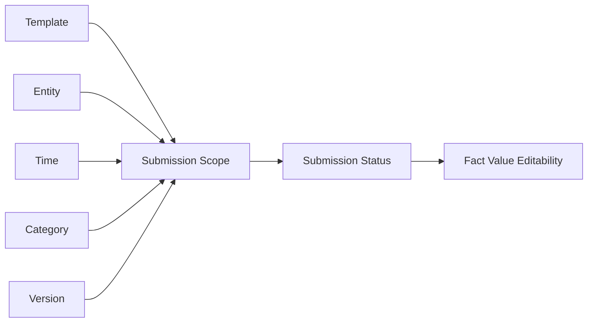
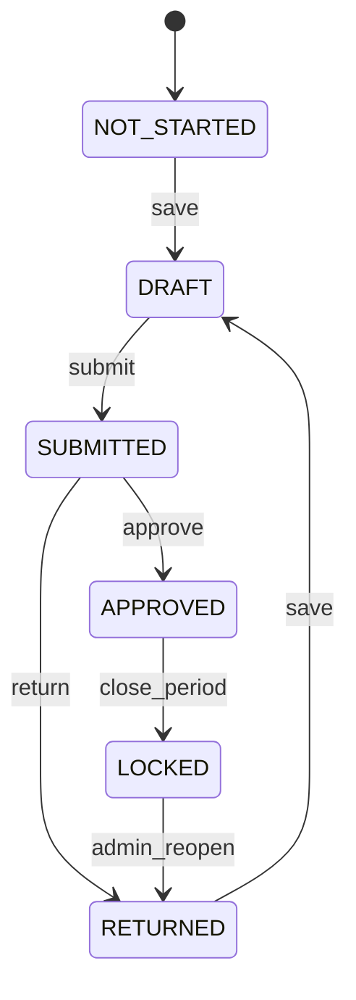

# BPC-KB-004: Data Input And Work Status

阶段编号：BPC-KB-004

生成日期：2026-05-06

本文件抽取 SAP BPC 中数据填报、保存、提交、审批、锁定与 Work Status 的产品思想，并转换为自研 Web Native 预算填报状态设计原则。内容基于全量 OCR 缓存和页码定位，只保留结构化摘要，不复制 PDF 原文或 OCR 全文。

## 1. 本阶段结论

BPC 的 Work Status 体现了“按数据区域控制填报生命周期”的思想，但其复杂切片锁定和多维权限联动不适合直接照搬。

自研平台应吸收：

1. 保存草稿。
2. 提交确认。
3. 退回修改。
4. 审核通过。
5. 锁定防改。
6. 按组织、期间、版本、模板控制状态范围。

自研平台必须规避：

1. 难懂的 Work Status 切片锁定。
2. 状态与复杂多维权限矩阵强耦合。
3. Excel 插件里的隐式提交体验。
4. 黑盒流程和不可追踪的状态变更。

## 2. 来源定位

| 主题 | 主要来源 |
| --- | --- |
| Work Status | BPC420 p6, p16, p82-p83, p94, p109；BPC450 p98-p99, p228；S4F80 p146-p149；s4f90 p69, p107，OCR |
| Submit / Submitted | BPC420 p292, p295, p300, p302, p347；BPC450 p42, p85, p93, p146, p152；S4F80 p182-p183，OCR |
| Approve / Approval | BPC420 p108-p109, p291, p297, p300；BPC450 p246, p248, p278, p285；S4F80 p170, p183，OCR |
| Reject | BPC420 p292, p300；BPC440 p248, p253, p263；S4F80 p181, p183；s4f90 p258, p262-p263，OCR |
| Lock / Unlock | BPC420 p83, p94, p145-p149；BPC450 p16-p17, p94-p95, p182, p249；S4F80 p122-p123, p146-p147，OCR |
| Owner / Reviewer | BPC420 p16, p32-p33, p300；BPC440 p253-p263；S4F80 p170-p183；s4f90 p257-p267，OCR |
| Data Input / Save Data | BPC420 p133, p140, p142, p227, p296, p309；BPC430 p125；BPC450 p228-p229；S4F80 p78, p155, p192，OCR |

## 3. BPC 思想抽取

### 3.1 数据填报是一个生命周期

BPC 资料中 Data Input、Save Data、Submit、Approve、Reject 等术语说明，预算填报不是一次性录入，而是从草稿到提交、审核、锁定的生命周期。

自研取舍：

1. 保存和提交必须分开。
2. 保存用于草稿，提交用于流程承诺。
3. 审核通过后应限制继续修改。
4. 退回后应保留历史状态和意见。
5. 每次状态变化必须可审计。

### 3.2 Work Status 是范围控制

BPC 的 Work Status 常与模型、期间、组织、版本等维度范围相关。它的价值在于明确哪些数据区域可以编辑、提交或锁定。

自研取舍：

1. 状态范围必须显式、可解释。
2. MVP 使用 Template + Entity + Time + Category + Version 作为状态范围。
3. 不做用户难以理解的任意维度切片锁定。
4. 后续如需要更细锁定，也必须先有清晰 UI 和审计。

### 3.3 Owner / Reviewer 是协作角色

BPC 中 Owner、Reviewer、Approver 等概念说明填报流程至少需要责任人与审核人。

自研取舍：

1. MVP 先支持填报人和审核人。
2. 填报责任优先绑定组织和模板。
3. 审核责任优先绑定组织上级或模板配置。
4. 不在 MVP 做复杂多角色、多路径审批流。

### 3.4 Lock 是结果，不是用户心智

BPC 中 Lock / Locked / Unlock 与 Work Status 相关，但用户真正关心的是“能不能改、为什么不能改、谁能退回”。

自研取舍：

1. UI 显示业务状态，而不是暴露复杂锁定术语。
2. 锁定由状态推导，不作为独立复杂配置暴露给业务用户。
3. 管理员可解锁，但必须记录原因。

## 4. 自研状态模型建议

| 状态 | 中文名 | 可编辑 | 说明 |
| --- | --- | --- | --- |
| NOT_STARTED | 未开始 | 是 | 尚未保存或提交 |
| DRAFT | 草稿 | 是 | 已保存但未提交 |
| SUBMITTED | 已提交 | 否 | 填报人提交，等待审核 |
| RETURNED | 已退回 | 是 | 审核人退回修改 |
| APPROVED | 已通过 | 否 | 审核通过，进入锁定 |
| LOCKED | 已锁定 | 否 | 管理锁定或关闭期间 |

MVP 可以先把 `APPROVED` 与 `LOCKED` 合并展示为“已通过/不可编辑”，内部保留锁定标识。

## 5. 状态范围建议

建议范围字段：

| 字段 | 说明 | MVP 必需 |
| --- | --- | --- |
| template_id | 填报模板 | 是 |
| model_id | 预算模型 | 是 |
| entity_member_id | 填报组织 | 是 |
| time_member_id | 期间 | 是 |
| category_member_id | Budget / Forecast 等 | 是 |
| version_member_id | 预算版本 | 是 |
| owner_user_id | 填报责任人 | 是 |
| reviewer_user_id | 审核人 | 是 |

不建议 MVP 使用任意维度组合做状态范围，否则会复刻 BPC Work Status 的理解成本。

## 6. 状态流转建议

关键规则：

1. 保存不代表提交。
2. 提交前必须完成模板校验。
3. 已提交状态下填报人不可修改。
4. 退回后填报人可修改并重新提交。
5. 审核通过后默认不可修改。
6. 管理员重开必须记录原因。

## 7. 权限最小化建议

| 角色 | 能力 |
| --- | --- |
| 填报人 | 查看自己负责范围；保存草稿；提交；查看退回意见 |
| 审核人 | 查看审核范围；退回；通过；查看历史 |
| 预算管理员 | 配置模板、范围、责任人；必要时重开状态 |
| 只读用户 | 查询已授权数据 |

MVP 不做：

1. 任意维度成员交叉权限矩阵。
2. 每个单元格级权限。
3. 多级条件审批。
4. 与组织层级深度联动的复杂继承。

## 8. 审计要求

每次状态变更都应记录：

| 字段 | 说明 |
| --- | --- |
| action | save / submit / return / approve / lock / reopen |
| from_status | 变更前状态 |
| to_status | 变更后状态 |
| operator | 操作人 |
| operated_at | 操作时间 |
| reason | 退回、重开、锁定原因 |
| scope | 模板、组织、期间、类别、版本 |

审计是规避 BPC 黑盒感的关键。

## 9. 规避原则

1. 不照搬 Work Status 的复杂切片锁定配置。
2. 不把状态、权限、维度、组织层级揉成难以解释的矩阵。
3. 不把提交动作隐藏在 Excel 保存或刷新里。
4. 不允许无审计地解锁和重开。
5. 不在 MVP 做复杂流程设计器。
6. 不提前做预算执行差异分析。

## 10. 后续阶段输入

BPC-KB-005 查询、汇总、报表阶段应考虑：

1. 查询时区分草稿、已提交、已通过数据。
2. 默认报表使用已提交或已通过数据。
3. 管理端可查看填报进度和状态分布，但不等同于 BI 图表。

BPC-KB-006 实际数导入阶段应考虑：

1. 导入实际数不走填报提交流。
2. 但导入批次必须有状态和审计。
3. Actual 与 Budget 同源事实数据，但流程状态不同。

## 11. 待复核问题

1. OCR 页码需要在后续关键设计前抽样复核。
2. Work Status 在 Standard、Embedded、S/4 优化场景下语义可能略有差异，ARCH-001 应固定自研语义。
3. `APPROVED` 与 `LOCKED` 是否拆分，需要在 PRODUCT-001 结合 MVP 用户流程决定。
