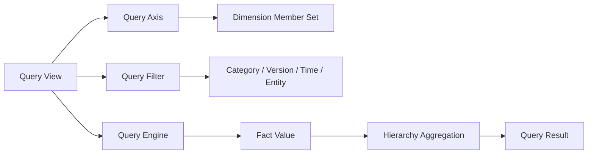

# BPC-KB-005: Query, Aggregation And Reporting

阶段编号：BPC-KB-005

生成日期：2026-05-06

本文件抽取 SAP BPC 中查询、汇总、报表、EPM Report、Query、Axis、Refresh、Drill、Aggregation 等产品思想，并转换为自研 Web Native 预算平台的基础查询与汇总设计原则。内容基于全量 OCR 缓存和页码定位，只保留结构化摘要，不复制 PDF 原文或 OCR 全文。

## 1. 本阶段结论

BPC 的报表与查询能力本质上是“基于模型、维度、成员、层级和过滤条件读取事实数据，并按行列轴展示汇总结果”。

自研平台应吸收：

1. 报表绑定模型。
2. 行、列、筛选轴绑定维度和成员。
3. 成员选择与层级展开。
4. 查询刷新与结果读取。
5. 基于层级的汇总。
6. 从汇总结果钻取到底层明细或来源。

自研平台必须规避：

1. Excel / Office 插件依赖。
2. 把报表文件当成数据模型。
3. 复杂 BI 图表和仪表盘提前进入 MVP。
4. 复杂动态计算、MDX 暴露和不可解释脚本。
5. 查询、填报、权限、状态混杂为难维护黑盒。

## 2. 来源定位

| 主题 | 主要来源 |
| --- | --- |
| Report / Reporting | BPC420 p11-p15, p51, p74-p77；BPC430 p1, p5-p6, p13, p16, p18-p25, p34；BPC440 p11, p15, p23, p37-p38；BPC450 p6, p17, p32, p44, p47；S4F80 p5, p9, p14, p21，OCR |
| EPM Report | BPC420 p149, p153；BPC430 p5, p22, p43-p44, p61, p90, p107, p116-p117, p125；BPC440 p60；s4f90 p342，OCR |
| Query | BPC420 p86, p118, p123, p282-p285；BPC430 p95, p113, p115-p118, p143-p149；BPC450 p13, p17, p19, p38, p46, p49, p66-p67, p77-p78；S4F80 p71-p72, p79-p81，OCR |
| Page / Row / Column Axis | BPC420 p147-p150；BPC430 p48, p56, p61, p78, p97-p98, p103, p113, p119, p137-p140；BPC440 p61, p64, p66-p67；BPC450 p237，OCR |
| Member Selector | BPC420 p142, p146, p150；BPC430 p43-p44, p51, p53, p63, p65, p71-p72, p75；BPC440 p61, p63, p66-p67，OCR |
| Refresh / Retrieve | BPC420 p124, p142-p143, p154, p157, p258, p261, p285；BPC430 p51, p62, p85, p91, p127, p131, p135, p137, p173, p203，OCR |
| Drill / Drill Through | BPC420 p46, p94, p142, p282, p351, p376；BPC430 p17, p22, p33, p94-p95, p143-p146；S4F80 p16, p52, p119, p124，OCR |
| Aggregation / Aggregate | BPC420 p14, p21-p22, p115, p273, p282；BPC430 p79, p171, p176-p181, p226；BPC450 p29, p31-p32, p85, p150；S4F80 p11, p20, p58, p60，OCR |
| Local Member / Dynamic Calculation | BPC420 p227, p244, p282-p285；BPC430 p55, p73, p94-p95, p102, p107-p109；BPC450 p121, p126-p130，OCR |

## 3. BPC 思想抽取

### 3.1 报表是一种只读多维视图

BPC 报表和 EPM Report 使用行轴、列轴、页轴、过滤、成员选择等机制，把模型事实数据投影为可读表格。它与 Input Schedule 形态相近，但目的偏向查询、读取和分析。

自研取舍：

1. 报表必须绑定预算模型。
2. 报表配置保存视图定义，不保存事实数据。
3. 行、列、筛选轴必须引用模型维度和成员。
4. 查询结果来自事实数据和维度层级汇总。
5. 报表默认只读，填报入口仍由模板承担。

### 3.2 查询定义要显式、可解释

BPC Embedded 资料中 Query 常被描述为报表定义，包含固定过滤、行列、默认值和用户可调整项。该思想适合转化为 Web 查询定义。

自研取舍：

1. Query Definition 应显式保存模型、轴、过滤、成员范围和展示字段。
2. 用户可以调整筛选条件，但不能绕过模型维度约束。
3. 查询返回的数据口径必须能解释为一组事实坐标和汇总规则。
4. 不暴露 MDX、BW Query 或复杂脚本给业务用户。

### 3.3 汇总来自成员层级

BPC 中 Aggregation、Hierarchy、Aggregate 等概念说明，汇总应由维度成员层级和查询上下文产生。

自研取舍：

1. 汇总不依赖模板或报表中的手工合计行。
2. 汇总节点应从成员父子层级推导。
3. 叶子事实数据是主来源，汇总结果可缓存但应可重算。
4. MVP 先支持按一个主层级做基础汇总。

### 3.4 刷新与钻取是查询体验，不是数据治理

BPC 的 Refresh、Retrieve、Drill、Drill Through 体现了用户需要刷新数据、展开层级、查看来源或跳转外部明细的体验。

自研取舍：

1. Web 报表应提供刷新按钮和查询条件变更后的重新计算。
2. 钻取应优先支持从汇总格查看底层成员和事实明细。
3. Drill Through 到外部系统、ERP 或网站不进入 MVP。
4. 刷新不能触发隐式提交或隐藏数据写入。

### 3.5 Local Member 和动态计算需要受控

BPC 报表中的 Local Member、Dynamic Calculation 能增强展示和临时计算，但也容易让报表成为第二套逻辑系统。

自研取舍：

1. MVP 支持只读派生列或展示计算，例如小计、百分比、差额显示。
2. 派生计算不得直接写回事实数据。
3. 复杂动态计算、跨模型公式和脚本化报表后置。
4. 报表计算规则必须命名、可审计、可复核。

## 4. Web Native 查询对象建议

| 对象 | 说明 | MVP 必需 |
| --- | --- | --- |
| Query View | 查询视图主对象，绑定模型和展示目的 | 是 |
| Query Axis | 行轴、列轴、筛选轴定义 | 是 |
| Axis Member Set | 轴上的成员集合、层级节点或叶子集合 | 是 |
| Query Filter | 固定筛选和用户筛选条件 | 是 |
| Query Measure | 金额、数量、比例等展示指标 | 是 |
| Query Result Cell | 查询结果单元格，来自事实数据或汇总 | 是 |
| Aggregation Rule | 按成员层级汇总的规则 | 是 |
| Drill Context | 汇总格向下钻取的上下文 | 中期，MVP 可做基础明细 |
| Display Rule | 数字格式、缩进、隐藏空行、排序 | 中期 |
| Calculated Item | 只读展示计算项 | 中期 |

## 5. 查询与事实数据关系

关键原则：

1. Query View 负责定义如何读数据。
2. Fact Value 是唯一事实来源。
3. Hierarchy Aggregation 负责把叶子数据汇总到父节点。
4. Query Result 是可缓存结果，不是业务主数据。
5. 查询服务应能区分 Actual、Budget、Forecast 和 Version。

## 6. 与填报状态的关系

查询和报表必须尊重 BPC-KB-004 的状态结论，但不把状态逻辑做成报表私有规则。

| 数据状态 | 查询处理建议 |
| --- | --- |
| DRAFT | 默认不进入正式报表；填报人可在模板内查看 |
| SUBMITTED | 可进入管理查询和进度监控 |
| APPROVED / LOCKED | 默认进入正式预算报表 |
| Actual 导入数据 | 由导入批次和数据类别控制，不走填报状态 |

MVP 默认报表口径建议：正式查询优先使用已提交或已通过预算数据，草稿数据只在填报工作台展示。

## 7. MVP 报表能力边界

| 能力 | MVP 处理 | 后置能力 |
| --- | --- | --- |
| 报表创建 | 绑定模型、名称、说明、启停 | 报表文件夹和发布审批 |
| 行列轴 | 选择维度、成员集合、层级节点 | 多轴嵌套和复杂交叉布局 |
| 筛选 | 组织、期间、类别、版本 | 用户自定义多条件筛选器 |
| 汇总 | 主层级父子汇总 | 多层级、多口径汇总 |
| 刷新 | 基于当前筛选重新查询 | 定时刷新和缓存失效策略 |
| 钻取 | 汇总格查看底层成员或事实明细 | 外部系统 Drill Through |
| 展示计算 | 可后置；MVP 先不做复杂公式 | Local Member、动态计算、跨模型公式 |
| 图表 BI | 不进入 MVP | 需另立阶段 |
| Excel / Office 报表 | 不作为主能力 | 导出可后置 |

## 8. 查询校验规则建议

| 校验点 | 规则 |
| --- | --- |
| 模型绑定 | 查询视图必须绑定一个启用预算模型 |
| 维度引用 | 行、列、筛选轴引用的维度必须属于模型 |
| 成员引用 | 成员必须有效，停用成员仅可用于历史查询 |
| 轴冲突 | 同一维度不能在行轴、列轴、固定筛选中产生冲突 |
| 数据状态 | 查询必须明确是否包含草稿、已提交、已通过或实际数 |
| 权限 | 用户只能查询授权组织、模板、类别和版本范围 |
| 汇总 | 汇总节点必须能追溯到层级和叶子成员范围 |
| 空值 | 空事实坐标应区分 0、空值和未填报 |

## 9. 规避原则

1. 不开发 Excel / Office 插件作为主报表入口。
2. 不把报表视图当成事实数据存储。
3. 不提前建设 BI 图表、仪表盘和预算执行差异分析。
4. 不暴露复杂 MDX、BW Query、Script Logic 给业务用户。
5. 不允许报表刷新触发隐式保存、提交或导入。
6. 不把报表权限做成任意维度成员交叉矩阵。
7. 不把 Local Member 和动态计算做成不可追踪的影子业务规则。

## 10. 后续阶段输入

BPC-KB-006 实际数导入阶段应考虑：

1. Actual 导入数据进入同源事实数据，供 Query View 读取。
2. Import Batch 状态和数据类别应成为查询过滤条件。
3. 导入错误数据不得进入正式查询口径。

BPC-KB-009 路线图阶段应考虑：

1. 报表 MVP 位于预算填报基础版之后。
2. 基础查询与汇总优先于图表 BI。
3. 预算与实际差异分析必须在用户明确批准后再进入。

## 11. 待复核问题

1. OCR 页码可能与 PDF 阅读器页码存在偏移，关键页需后续抽样复核。
2. BPC430 对 EPM 报表和 Office 插件的内容较多，自研只吸收多维查询思想，不复制插件交互。
3. Embedded BPC 中 Query 与 BW Query / Analysis Office 语义更强，ARCH-001 应固定自研 Query View 的简化语义。
4. 是否支持只读计算列、导出和报表共享，需要在 PRODUCT-001 结合 MVP 范围裁剪。
