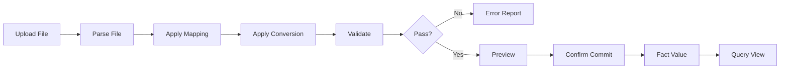

# BPC-KB-006: Data Manager And Actual Import

阶段编号：BPC-KB-006

生成日期：2026-05-06

本文件抽取 SAP BPC 中 Data Manager、Data Package、Transformation、Conversion、Flat File、Import、Actual Data 等产品思想，并转换为自研 Web Native 预算平台的实际数导入设计原则。内容基于全量 OCR 缓存和页码定位，只保留结构化摘要，不复制 PDF 原文或 OCR 全文。

## 1. 本阶段结论

BPC 的 Data Manager 体现了“把外部数据通过包、转换、映射、校验导入模型”的思想，但其执行过程容易被用户感知为黑盒。

自研平台应吸收：

1. 导入任务。
2. 数据包或批次。
3. 字段映射。
4. 成员转换。
5. 导入前校验。
6. 导入日志和错误报告。
7. Actual 与 Budget 进入同源事实数据。

自研平台必须规避：

1. 黑盒 Data Manager 包。
2. 隐藏在后台 Process Chain 的不可解释执行。
3. 复杂 Transformation / Conversion 文件语法暴露给业务用户。
4. 导入失败原因不可追踪。
5. 导入实际数直接绕过模型、维度和成员校验。
6. MVP 阶段 ERP 直连。

## 2. 来源定位

| 主题 | 主要来源 |
| --- | --- |
| Data Manager | BPC420 p13, p25-p26, p51, p73, p78, p81, p120, p133, p160-p162；BPC430 p12, p17, p20, p25, p39-p40；BPC440 p10, p50, p53-p54, p58, p75-p76, p82-p83；BPC450 p16，OCR |
| Data Package / Run Package | BPC420 p162-p166, p169, p173, p192-p195, p217, p264；BPC440 p58, p82；s4f90 p132，OCR |
| Transformation / Transformation File | BPC420 p75-p76, p161-p162, p173, p175-p179, p183, p187-p188, p191-p194, p209-p212；BPC440 p75-p79, p83, p159，OCR |
| Conversion / Conversion File | BPC420 p75-p76, p162, p175-p177, p179, p187, p191, p195, p207, p212, p224, p274；BPC440 p75-p79, p83, p153, p159，OCR |
| Flat File / Import | BPC420 p160, p175-p183, p305；BPC440 p75-p83, p111, p256；BPC450 p113-p114, p122, p125, p139-p140, p185-p188；S4F80 p208，OCR |
| Validation / Error | BPC420 p75-p76, p92, p173, p178, p211, p237, p241, p245, p249-p250, p257, p328-p332；BPC440 p73, p78, p82, p108, p112, p116, p126, p128；s4f90 p245-p248，OCR |
| Actual / Actual Data | BPC420 p12, p56, p147, p237, p242, p246, p248-p249, p271-p272, p303；BPC450 p49, p66, p170-p171；S4F80 p19, p50, p58-p68, p72, p103，OCR |
| Audit / Source Data | BPC420 p37, p42, p46, p55-p56, p82-p83, p90, p178, p297, p313；BPC440 p77-p79, p87-p89；BPC450 p67, p98, p116-p119, p245-p257；S4F80 p164, p205，OCR |

## 3. BPC 思想抽取

### 3.1 Data Manager 是导入过程编排

BPC 的 Data Manager 不只是上传文件，而是围绕数据包、转换、校验、执行日志组织导入过程。

自研取舍：

1. 导入必须是一个可追踪 Import Job。
2. 每次执行必须生成 Import Batch。
3. 文件上传、字段映射、成员映射、校验、预览、提交入库应分步展示。
4. 用户必须看见当前导入在哪一步失败。
5. 不把导入动作隐藏在不可解释的后台包里。

### 3.2 Transformation 是字段到模型口径的映射

BPC 的 Transformation File 用于把来源文件字段映射到目标模型维度、属性或关键值。

自研取舍：

1. 用可视化 Import Mapping 替代脚本式 transformation 文件。
2. 映射必须明确来源列、目标维度、目标成员编码或目标金额字段。
3. 缺失必需维度必须在校验阶段阻断。
4. 映射配置应版本化，便于复用和审计。

### 3.3 Conversion 是外部编码到内部成员的转换

BPC 的 Conversion File 常用于把外部系统编码转换为 BPC 成员编码。

自研取舍：

1. 建立 Import Conversion Rule，把外部编码映射到 Dimension Member。
2. 转换不成功的数据进入错误明细，不进入正式事实数据。
3. 映射关系必须可维护、可导出、可审计。
4. 不允许用隐藏公式或脚本临时改写成员。

### 3.4 Actual 数据要与 Budget 同源

BPC 和 S/4 优化资料说明 Actual Data 与 Plan Data 需要共享可查询口径。自研平台应把 Actual 作为 Category 或数据类别进入同一事实模型，而不是另建一套孤立结构。

自研取舍：

1. Actual、Budget、Forecast 共享事实数据结构。
2. Category 表示 Actual / Budget / Forecast。
3. Version 表示预算版本、预测版本或导入批次口径中的版本策略。
4. Actual 导入不走填报提交流，但必须有导入批次状态和审计。
5. 后续查询可以基于同一事实模型读取 Actual 与 Budget。

### 3.5 导入校验必须先于入库

BPC 资料中的 Validation、Error、Rejected 等概念说明导入不能只关注文件上传成功，还要检查数据能否进入模型。

自研取舍：

1. 导入前必须执行结构校验、维度校验、成员校验、数值校验和重复坐标校验。
2. 校验通过前不得写入正式事实数据。
3. 导入预览应显示成功行、失败行、警告和总金额。
4. 用户确认后再提交入库。
5. 错误报告应可下载或在 Web 中查看。

## 4. Web Native 导入对象建议

| 对象 | 说明 | MVP 必需 |
| --- | --- | --- |
| Import Job | 导入任务定义，绑定模型、类别、来源类型和映射配置 | 是 |
| Import Batch | 单次导入执行批次，记录文件、操作者、状态、时间 | 是 |
| Import File | 上传文件元数据，不提交原始业务文件到 Git | 是 |
| Import Mapping | 来源列到目标字段、维度、金额的映射 | 是 |
| Conversion Rule | 外部编码到维度成员编码的转换规则 | 是 |
| Validation Result | 校验结果汇总 | 是 |
| Validation Error | 行级错误明细 | 是 |
| Import Preview | 入库前预览结果 | 是 |
| Import Commit | 确认写入事实数据的动作 | 是 |
| Import Audit Log | 导入步骤和状态变更审计 | 是 |

## 5. 导入流程建议

关键规则：

1. 上传成功不等于导入成功。
2. Parse、Mapping、Conversion、Validate、Preview、Commit 必须有独立状态。
3. Commit 前不得影响正式查询口径。
4. Commit 后必须能按 Import Batch 撤销或冲销，具体机制在 ARCH-001 再定。

## 6. 导入批次状态建议

| 状态 | 中文名 | 说明 |
| --- | --- | --- |
| UPLOADED | 已上传 | 文件已接收，尚未解析 |
| PARSED | 已解析 | 文件结构读取成功 |
| MAPPED | 已映射 | 已应用字段映射和转换规则 |
| VALIDATED | 已校验 | 校验完成，可能有错误或警告 |
| PREVIEWED | 已预览 | 用户已查看入库前结果 |
| COMMITTED | 已入库 | 正式写入事实数据 |
| FAILED | 失败 | 任一关键步骤失败 |
| CANCELLED | 已取消 | 用户取消本次导入 |

Actual 导入批次状态不复用 BPC-KB-004 的填报状态。填报状态控制人工预算流程，导入状态控制文件与批次处理流程。

## 7. 导入校验规则建议

| 校验点 | 规则 |
| --- | --- |
| 文件结构 | 必需列存在，表头可识别，文件格式可解析 |
| 模型维度 | 导入数据必须满足目标模型维度集合 |
| 成员编码 | 外部编码必须能转换为有效 Dimension Member |
| 类别 | Actual 导入必须进入 Category = Actual |
| 版本 | 必须明确版本策略，不能隐式覆盖历史数据 |
| 期间 | 期间必须属于有效 Time 成员 |
| 金额 | 数值格式、精度、正负号必须可解释 |
| 重复坐标 | 同一批次内重复事实坐标必须有合并或拒绝规则 |
| 权限 | 用户只能导入授权模型、组织和期间范围 |
| 状态 | 已锁定或关闭期间不可被导入覆盖，除非管理员重开并审计 |

## 8. 与查询和填报的关系

| 关系 | 设计建议 |
| --- | --- |
| 与 BPC-KB-002 元模型 | 导入结果写入同源 Fact Value，必须引用模型和维度成员 |
| 与 BPC-KB-004 填报状态 | Actual 导入不走预算提交/审批流，但受期间锁定和审计控制 |
| 与 BPC-KB-005 查询 | Query View 可读取已提交的 Import Batch 数据，错误批次不进入正式查询 |
| 与未来差异分析 | 只为后续 Actual vs Budget 留口径，不在本阶段开发差异分析 |

## 9. 规避原则

1. 不照搬 BPC 黑盒 Data Manager。
2. 不暴露复杂 Transformation / Conversion 文件语法给业务用户。
3. 不在 MVP 做 ERP 直连。
4. 不允许校验失败数据进入正式事实数据。
5. 不允许导入绕过维度成员和权限校验。
6. 不让导入刷新、报表刷新或模板保存互相隐式触发。
7. 不在本阶段引入预算执行差异分析。

## 10. 后续阶段输入

BPC-KB-007 权限、状态、流程与协作阶段应考虑：

1. 导入权限与填报权限不同，需单独定义。
2. 导入批次需要操作者、审核者或管理员可追踪。
3. 关闭期间或锁定范围的导入例外必须强审计。

BPC-KB-009 路线图阶段应考虑：

1. 实际数导入应在预算查询与基础汇总之后进入 MVP。
2. ERP 直连不进入 MVP，先支持文件导入。
3. 差异分析必须在用户明确批准后进入。

## 11. 待复核问题

1. OCR 页码可能与 PDF 阅读器页码存在偏移，关键页需后续抽样复核。
2. BPC Standard 与 Embedded 在数据导入技术栈上差异较大，自研平台应优先采用技术中立的 Import Job 抽象。
3. Actual 导入的撤销策略是物理删除、批次冲销还是新批次覆盖，需要 ARCH-001 再定。
4. 导入文件原文和业务数据样例是否进入仓库必须严格受控，默认不得提交。
