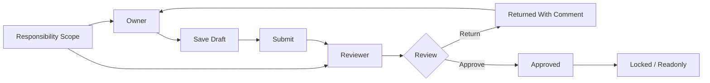

# BPC-KB-007: Access, Status, Process And Collaboration

阶段编号：BPC-KB-007

生成日期：2026-05-06

本文件抽取 SAP BPC 中 Data Access、Task Profile、Team、Owner、Reviewer、Work Status、Business Process Flow、Activity、Comment、Audit 等产品思想，并转换为自研 Web Native 预算平台的最小权限、状态、流程与协作设计原则。内容基于全量 OCR 缓存和页码定位，只保留结构化摘要，不复制 PDF 原文或 OCR 全文。

## 1. 本阶段结论

BPC 在权限和协作上提供了完整但复杂的体系：任务权限、数据访问权限、团队、Owner/Reviewer、Work Status 和 Business Process Flow 互相配合。其思想有价值，但复杂度不适合照搬到预算 MVP。

自研平台应吸收：

1. 功能权限和数据权限分离。
2. 数据权限以组织、模板、期间、类别、版本为核心范围。
3. Owner / Reviewer 作为填报协作的最小责任角色。
4. Work Status 作为状态锁定和可编辑性来源。
5. 流程活动、评论和审计用于透明协作。
6. 管理员可配置责任范围，但必须可解释、可追踪。

自研平台必须规避：

1. 复杂多维 Data Access Profile 矩阵。
2. Task Profile 与底层平台对象深度耦合。
3. Teams、Owner、Reviewer、Work Status、BPF 混杂成难解释流程网。
4. 复杂 BPF 流程设计器进入 MVP。
5. 无审计的权限变更、解锁、退回和重开。

## 2. 来源定位

| 主题 | 主要来源 |
| --- | --- |
| Data Access / Data Access Profile | BPC420 p39, p77, p90, p93, p97-p100, p102, p276, p309, p333, p345；BPC440 p250, p264；BPC450 p15, p56, p192, p260, p265-p266, p268；s4f90 p17, p97, p342，OCR |
| Task Profile | BPC420 p39, p90, p93-p96, p99-p103, p162-p163；BPC430 p168；BPC440 p139, p250, p264；s4f90 p332，OCR |
| Team / Teams | BPC420 p39, p90, p93, p95-p104, p107, p182, p292；BPC440 p82, p102, p250, p252-p255；BPC450 p24, p35, p219, p246, p250-p251, p261, p265, p283；S4F80 p172, p182, p184，OCR |
| Owner / Reviewer | BPC420 p16, p32-p33, p300, p302, p307, p310-p311, p318；BPC440 p253-p254, p257, p262-p263；BPC450 p246-p250, p253, p277, p282, p284；S4F80 p170-p173, p182-p187；s4f90 p337-p338，OCR |
| Security / Authorization | BPC420 p16-p17, p27, p35, p39, p41, p46, p77, p89-p94, p101, p222, p332, p368；BPC450 p24, p123, p126, p203, p260-p267；s4f90 p330-p333，OCR |
| Work Status / Lock / Unlock | BPC420 p82-p83, p94, p109, p142, p155, p183, p209, p217, p290-p296；BPC450 p98-p99, p228, p245-p250；S4F80 p146-p149, p170-p173；s4f90 p264, p314-p317，OCR |
| Business Process Flow / BPF | BPC420 p290, p296, p299-p303, p307, p309；BPC430 p35-p42, p203；BPC440 p246, p251-p264；BPC450 p245, p253, p277-p289；S4F80 p159, p170-p184；s4f90 p330, p334-p342，OCR |
| Activity / Step / Comment / Audit | BPC420 p300-p307, p313；BPC440 p248-p257, p263-p264；BPC450 p116-p119, p245-p257；S4F80 p181-p195, p205；s4f90 p341，OCR |

## 3. BPC 思想抽取

### 3.1 功能权限与数据权限分离

BPC 中 Task Profile 更偏向用户可以执行哪些任务，Data Access Profile 更偏向用户能访问哪些维度成员和数据范围。

自研取舍：

1. 功能权限控制“能做什么”，例如配置模板、填报、审核、导入、查询。
2. 数据权限控制“能看/改哪些数据范围”，例如组织、期间、类别、版本、模板。
3. 两者必须分离配置、分离审计。
4. MVP 不做任意维度成员交叉矩阵，避免权限解释成本失控。

### 3.2 Team 是管理手段，不是业务主模型

BPC 中 Team 用于组织用户、任务和数据访问配置。它的思想是减少逐人授权，但团队本身不应取代组织维度或责任范围。

自研取舍：

1. MVP 可先用 Role Assignment 和 Responsibility Scope，不必引入复杂 Team 管理。
2. 后续可引入用户组，但必须服务于权限复用。
3. 组织责任仍应以 Entity 成员和模板范围表达。
4. 团队变更必须审计。

### 3.3 Owner / Reviewer 是协作最小闭环

BPC 的 Owner、Reviewer 和 BPF 活动说明，预算协作至少要能表达谁负责填报、谁负责审核、当前任务在哪个状态。

自研取舍：

1. MVP 只做 Owner 和 Reviewer 两类核心责任人。
2. Owner 可以保存和提交自己负责范围。
3. Reviewer 可以退回和通过自己审核范围。
4. 预算管理员配置责任关系和处理例外。
5. 不做多级审批、条件路由和复杂流程设计器。

### 3.4 Work Status 控制可编辑性

BPC 的 Work Status、Lock、Unlock 与流程结合，用于控制数据区域是否可改。

自研取舍：

1. 可编辑性由 Submission Status 和期间锁定共同推导。
2. 用户界面展示业务状态和原因，不展示复杂切片锁定规则。
3. 管理员重开或解锁必须记录原因。
4. 状态变更是审计事件，不只是字段更新。

### 3.5 BPF 提供流程可见性，但不应提前复杂化

BPC 的 Business Process Flow 支持活动、步骤、分配、状态、评论和跟踪。这些能力对协作透明有价值，但完整流程设计器会让 MVP 失焦。

自研取舍：

1. MVP 用固定填报流程替代可配置 BPF：未开始、草稿、已提交、已退回、已通过、已锁定。
2. 管理端可查看任务列表、状态、责任人和逾期情况。
3. 活动评论和退回意见必须保留。
4. 流程模板版本管理、复杂实例变更、暂停恢复等能力后置。

## 4. 自研权限对象建议

| 对象 | 说明 | MVP 必需 |
| --- | --- | --- |
| User | 用户 | 是 |
| Role | 功能角色，如填报人、审核人、预算管理员、只读用户 | 是 |
| Permission | 功能权限，如 template.manage、submission.submit、import.commit | 是 |
| Role Permission | 角色与功能权限关系 | 是 |
| Responsibility Scope | 责任范围，绑定模板、组织、期间、类别、版本 | 是 |
| Data Scope | 数据访问范围，控制查询、填报、审核、导入可见性 | 是 |
| Owner Assignment | 填报责任人分配 | 是 |
| Reviewer Assignment | 审核责任人分配 | 是 |
| Team / User Group | 用户组或团队 | 后置 |
| Access Audit Log | 权限和责任变更审计 | 是 |

## 5. 最小角色建议

| 角色 | 功能范围 | 数据范围 |
| --- | --- | --- |
| 填报人 | 查看模板、保存草稿、提交、查看退回意见 | 自己负责的模板、组织、期间、类别、版本 |
| 审核人 | 查看提交数据、退回、通过、查看历史 | 自己审核的责任范围 |
| 预算管理员 | 配置模型、维度、模板、责任范围、状态例外、导入任务 | 预算空间内授权范围 |
| 导入管理员 | 创建导入任务、执行导入、查看错误、提交批次 | 授权模型、组织、期间、类别 |
| 只读用户 | 查询报表、查看已授权数据 | 授权查询范围 |

MVP 可以先把导入管理员能力由预算管理员承担，直到实际数导入阶段进入实现。

## 6. 协作流程建议

关键规则：

1. 责任范围先于任务生成。
2. 填报人与审核人必须可见。
3. 退回必须有意见。
4. 通过后默认不可编辑。
5. 例外重开必须由管理员操作并审计。

## 7. 审计事件建议

| 事件 | 说明 |
| --- | --- |
| ROLE_ASSIGNED | 用户角色变更 |
| DATA_SCOPE_CHANGED | 数据范围变更 |
| OWNER_ASSIGNED | 填报责任人变更 |
| REVIEWER_ASSIGNED | 审核责任人变更 |
| SUBMITTED | 填报提交 |
| RETURNED | 审核退回 |
| APPROVED | 审核通过 |
| LOCKED | 范围锁定 |
| REOPENED | 管理员重开 |
| IMPORT_COMMITTED | 导入批次入库 |

审计字段至少包括：事件类型、操作者、目标用户或范围、变更前后值、时间、原因、关联任务或批次。

## 8. 权限校验规则建议

| 校验点 | 规则 |
| --- | --- |
| 功能权限 | 用户必须具备操作对应 Permission |
| 数据范围 | 用户只能访问授权 Entity、Time、Category、Version、Template |
| 填报范围 | Owner 才能保存和提交对应范围 |
| 审核范围 | Reviewer 才能退回或通过对应范围 |
| 导入范围 | 导入者只能导入授权模型和数据范围 |
| 锁定范围 | 已锁定范围不可编辑或导入覆盖，除非管理员重开 |
| 查询范围 | 查询结果必须按数据范围过滤 |
| 权限变更 | 权限和责任范围变更必须写审计 |

## 9. 规避原则

1. 不照搬 BPC 多维 Data Access Profile 矩阵。
2. 不让权限配置依赖业务用户难以理解的底层技术对象。
3. 不在 MVP 做 BPF 流程设计器。
4. 不做多级条件审批和复杂路由。
5. 不把 Work Status、Data Access、Team、Owner、Reviewer 全部耦合成一个大配置页。
6. 不允许无审计的权限变更、退回、通过、锁定、重开。
7. 不提前建设合并报表流程和集团合并监控。

## 10. 后续阶段输入

BPC-KB-008 用户痛点与自研规避原则阶段应重点归纳：

1. 多维权限矩阵复杂难解释。
2. Work Status 与 BPF 组合复杂。
3. Excel / Office 插件和后台包导致用户感知黑盒。
4. 自研平台需要以责任范围、显式状态、简单角色和审计来降低复杂度。

BPC-KB-009 路线图阶段应考虑：

1. 权限 MVP 与元数据、模板、填报同步出现。
2. BPF 复杂流程后置。
3. 团队和多级审批后置。

## 11. 待复核问题

1. OCR 页码可能与 PDF 阅读器页码存在偏移，关键页需后续抽样复核。
2. BPC Standard、Embedded、S/4 优化场景中的 Work Status 与 BPF 配置差异较大，ARCH-001 应固定自研统一语义。
3. Team 是否进入 MVP 需要 PRODUCT-001 再裁剪。
4. 权限审计的存储粒度和查询方式需要 ARCH-001 设计。
