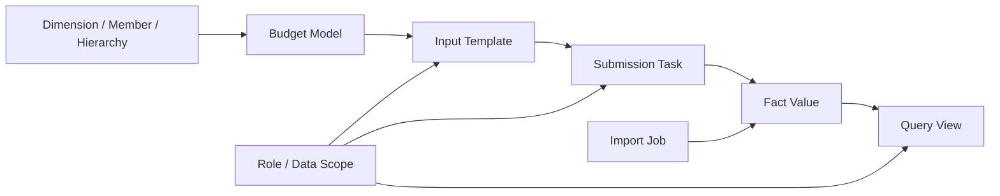

# BPC-KB-009: Budget Platform Module Roadmap

阶段编号：BPC-KB-009

生成日期：2026-05-06

本文件基于 BPC-KB-001 至 BPC-KB-008，制定自研 Web Native 企业级全面预算管理平台的模块路线图。本文只做产品路线图和范围边界，不写业务代码，不创建后端或前端工程。

## 1. 总体路线结论

平台路线必须先形成预算主线闭环，再逐步扩展复杂能力。

MVP 主线闭环：

1. 项目治理与基础框架。
2. 元数据模型。
3. 预算模型管理。
4. 预算模板管理。
5. 预算填报基础版。
6. 预算查询与基础汇总。
7. 实际数导入。

MVP 明确不包含：

1. 预算执行差异分析。
2. BI 图表和仪表盘。
3. 合并报表。
4. ERP 直连。
5. Excel / Office 插件。
6. 通用脚本逻辑。
7. 复杂流程设计器和多级审批。

## 2. 路线图输入来源

| 输入 | 对路线图的约束 |
| --- | --- |
| BPC-KB-001 核心术语 | 确定模型、维度、成员、层级、Category、Version、模板、填报、查询、导入等核心概念 |
| BPC-KB-002 模型维度 | 确定元数据和同源事实数据是最先建设的基础 |
| BPC-KB-003 模板 | 确定 Web Native 填报模板，不做 Excel 插件 |
| BPC-KB-004 填报状态 | 确定保存、提交、退回、通过、锁定和审计 |
| BPC-KB-005 查询报表 | 确定基础查询和层级汇总优先于 BI |
| BPC-KB-006 实际数导入 | 确定文件导入、映射、校验、预览、批次审计和 Actual/Budget 同源 |
| BPC-KB-007 权限协作 | 确定最小角色、责任范围、数据范围和审计 |
| BPC-KB-008 护栏 | 明确阶段外能力不得提前实现 |

## 3. 阶段路线图

| 阶段编号 | 阶段名称 | 类型 | 目标 | 主要产出 |
| --- | --- | --- | --- | --- |
| ARCH-001 | 技术架构基线设计 | 架构 | 固定技术栈、分层架构、同源事实数据、权限状态审计、导入批次设计 | 架构文档、ADR |
| PRODUCT-001 | MVP 产品范围与阶段拆分 | 产品 | 固定 MVP 功能边界、用户流程、验收标准 | MVP 产品范围文档 |
| DEV-000 | 创建后端 / 前端基础工程 | 工程 | 创建 Spring Boot / React Vite 或最终架构确定的基础工程 | 可编译空工程、基础 CI 命令 |
| BUD-001 | 项目治理与基础框架 | 开发 | 配置基础工程、统一错误、基础测试框架、文档规则 | 后端/前端基础框架 |
| BUD-002 | 元数据模型设计 | 设计 | 设计预算空间、模型、维度、成员、层级、Category、Version、Fact Value 逻辑模型 | 元数据设计文档、ADR |
| BUD-003 | 元数据后端 | 开发 | 实现维度、成员、层级、模型绑定基础 API | 后端 API、测试 |
| BUD-004 | 元数据前端 | 开发 | 实现元数据管理基础界面 | 前端页面、测试 |
| BUD-005 | 预算模型管理 | 开发 | 实现预算模型启停、维度绑定、模型配置基础能力 | 模型管理 API/UI |
| BUD-006 | 预算模板管理 | 开发 | 实现 Web 填报模板、行列轴、筛选、基础校验配置 | 模板管理 API/UI |
| BUD-007 | 预算填报基础版 | 开发 | 实现填报表格、保存草稿、提交、退回、通过、锁定、审计 | 填报 API/UI |
| BUD-008 | 预算查询与基础汇总 | 开发 | 实现 Query View、行列轴、筛选、层级汇总、基础钻取明细 | 查询 API/UI |
| BUD-009 | 实际数导入 | 开发 | 实现文件导入、映射、转换、校验、预览、提交批次 | 导入 API/UI |
| BUD-010 | 预算与实际差异分析 | 后置 | 只有用户明确批准后进入 | 后续另立计划 |

## 4. MVP 功能边界

### 4.1 必须进入 MVP

| 模块 | MVP 能力 |
| --- | --- |
| 元数据 | 维度、成员、单主层级、Category、Version |
| 模型 | 预算模型、模型维度绑定、启停 |
| 模板 | Web 表格模板、行轴、列轴、筛选、可编辑单元格、基础校验 |
| 填报 | 保存草稿、提交、退回、通过、锁定、操作审计 |
| 权限 | 填报人、审核人、预算管理员、只读用户、责任范围、数据范围 |
| 查询 | 查询视图、筛选、层级汇总、查看明细 |
| 实际数导入 | 文件导入、字段映射、成员转换、校验、预览、批次提交、错误报告 |

### 4.2 明确后置

| 能力 | 后置原因 |
| --- | --- |
| 预算执行差异分析 | 必须等预算、实际数、查询口径稳定，且需用户明确批准 |
| BI 图表 | 容易偏离主线，应在基础查询稳定后另立阶段 |
| 合并报表 | 属于 BPC 合并域，不进入预算 MVP |
| ERP 直连 | 先用文件导入验证模型和导入口径 |
| Excel 插件 | 与 Web Native First 冲突 |
| Script Logic | 会形成不可维护影子逻辑 |
| 多级审批 | 先用 Owner / Reviewer 最小闭环 |
| 复杂权限矩阵 | 先用角色 + 责任范围 + 数据范围 |

## 5. 核心对象演进顺序

建设原则：

1. 先有元数据，再有模型。
2. 先有模型，再有模板。
3. 先有模板，再有填报。
4. 先有事实数据，再有查询汇总。
5. 实际数导入写入同源事实数据。
6. 权限和审计贯穿模板、填报、查询、导入。

## 6. 关键架构前置决策

ARCH-001 必须回答：

1. 后端技术栈、前端技术栈、数据库和包管理方式。
2. 同源事实数据如何表达模型维度组合。
3. 动态维度如何在关系数据库中落地。
4. Category 与 Version 的最终字段语义。
5. 模板单元格如何解析为事实坐标。
6. Submission Status 与 Import Batch Status 如何分离。
7. 权限 Data Scope 如何过滤查询和操作。
8. 审计日志如何统一记录配置、状态、导入和权限变更。
9. 是否需要 ADR 固定“不做 Excel 插件、不做脚本逻辑、不做 ERP 直连”的架构边界。

## 7. 产品前置决策

PRODUCT-001 必须回答：

1. MVP 用户角色和用户故事。
2. 第一个预算场景使用费用预算、收入预算还是通用科目预算。
3. 默认维度集合：Account、Entity、Time、Category、Version 是否强制内置。
4. 模板 MVP 是否只支持单页模板。
5. 填报状态是否展示 `APPROVED` 与 `LOCKED` 两个状态，还是合并展示。
6. 实际数导入 MVP 支持 CSV、XLSX 还是两者都支持。
7. 查询 MVP 是否支持导出。
8. README 历史本地修改何时统一处理。

## 8. 里程碑验收建议

| 里程碑 | 验收标准 |
| --- | --- |
| M1 架构与产品基线 | ARCH-001、PRODUCT-001 完成；路线图和 ADR 明确 |
| M2 基础工程 | 后端、前端可编译；基础测试命令可运行 |
| M3 元数据闭环 | 可维护维度、成员、层级、模型绑定 |
| M4 模板与填报闭环 | 可建模板、填报、保存、提交、退回、通过 |
| M5 查询闭环 | 可按模型、组织、期间、类别、版本查询和汇总 |
| M6 实际数导入闭环 | 可导入 Actual，校验后进入同源事实数据 |

## 9. 风险与控制

| 风险 | 控制方式 |
| --- | --- |
| 动态维度落库复杂 | ARCH-001 先设计逻辑模型和物理模型取舍 |
| 模板变成 Excel 复刻 | BUD-006 只做 Web 表格和显式轴配置 |
| 状态权限耦合过深 | BUD-007 只做固定状态流和责任范围 |
| 查询提前演化为 BI | BUD-008 只做表格查询和基础汇总 |
| 导入变成黑盒 | BUD-009 强制预览、错误报告、批次审计 |
| 范围膨胀 | 每阶段只做一个业务模块，阶段外能力不进入 |

## 10. 是否进入开发

不建议立即进入开发。

必须先完成：

1. ARCH-001：技术架构基线设计。
2. PRODUCT-001：MVP 产品范围与阶段拆分。

完成上述两个阶段后，才进入 DEV-000 创建基础工程。

## 11. 待复核问题

1. README 当前仍有历史本地修改，需要后续专门阶段处理。
2. OCR 页码可能与 PDF 阅读器页码存在偏移，架构和产品关键决策引用前应抽样复核。
3. BUD-010 预算与实际差异分析仍需用户明确批准后才能进入。
