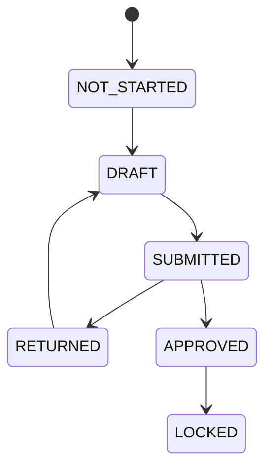
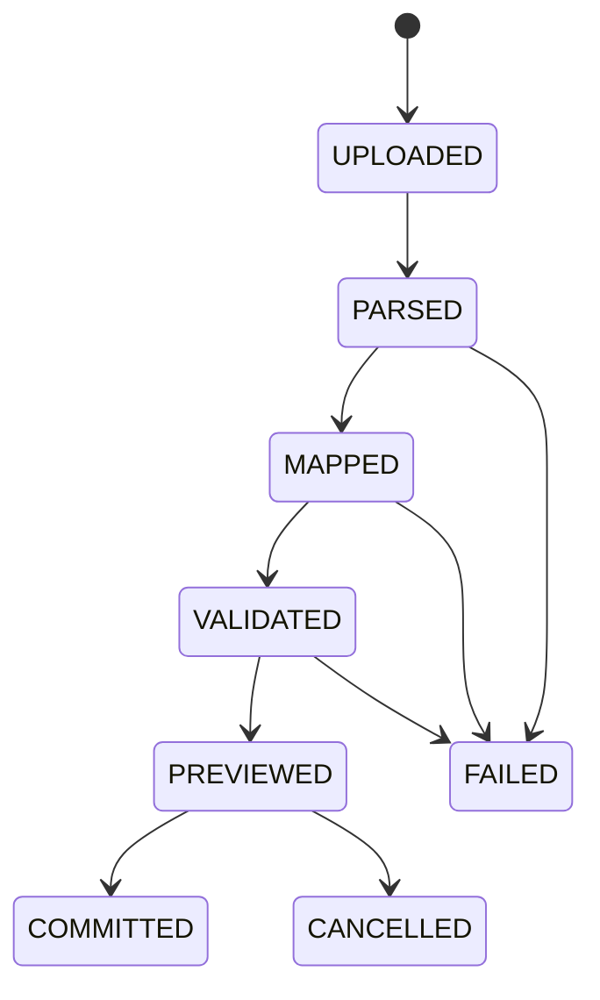

# PRODUCT-001: MVP Product Scope and Stage Breakdown

阶段编号：PRODUCT-001

生成日期：2026-05-06

本文件定义 Web Native 企业级全面预算管理平台 MVP 的产品范围、用户角色、核心流程、验收标准和后续开发阶段拆分。本文只写产品设计，不创建后端或前端工程，不新增 migration，不写业务代码。

## 1. 产品定位

本平台面向企业预算管理团队，提供从预算元数据、预算模型、Web 填报模板、预算填报、预算查询到实际数导入的最小闭环。

MVP 的核心目标不是复刻 SAP BPC，而是吸收其模型驱动、维度驱动、成员层级、Category、Version、Input Schedule、Data Manager、Work Status 等思想，并用 Web Native、显式配置、显式状态、透明导入和可审计流程降低复杂度。

## 2. MVP 结论

MVP 首个业务场景选择：费用预算。

选择理由：

1. 费用预算天然需要 Account、Entity、Time、Category、Version 等核心维度。
2. 填报流程通常是部门填报、预算负责人审核、预算管理员锁定，适合验证状态与权限闭环。
3. 实际费用导入可以验证 Actual 与 Budget 同源事实数据。
4. 不依赖合并报表、ERP 直连和复杂 BI，范围可控。

MVP 必须完成的主线：

1. 创建和维护核心维度、成员与单主层级。
2. 创建费用预算模型，并绑定维度。
3. 创建 Web 填报模板。
4. 按组织和期间发起填报任务。
5. 填报人保存草稿并提交。
6. 审核人退回或通过。
7. 预算管理员锁定已通过数据。
8. 查询预算数据和基础层级汇总。
9. 导入 Actual 费用数据，经映射、校验、预览后写入同源事实数据。

## 3. MVP 不包含

| 能力 | MVP 处理 |
| --- | --- |
| 预算执行差异分析 | 不进入 MVP；BUD-010 需另行明确批准 |
| BI 图表和仪表盘 | 不进入 MVP；只做表格查询和基础汇总 |
| 合并报表 | 不进入 MVP |
| ERP 直连 | 不进入 MVP；先做文件导入 |
| Excel / Office 插件 | 不开发 |
| Script Logic 或通用脚本 | 不开发 |
| 多级审批流程设计器 | 不开发；只做固定 Owner / Reviewer 流程 |
| 多主层级与复杂数据权限矩阵 | 后置；MVP 只做单主层级和可解释数据范围 |

## 4. 用户角色

| 角色 | 核心职责 | MVP 权限边界 |
| --- | --- | --- |
| Budget Admin | 预算平台管理员 | 管理模型、模板、任务、锁定和基础权限 |
| Metadata Manager | 元数据管理员 | 维护维度、成员、层级、Category、Version |
| Template Designer | 模板设计人 | 配置 Web 填报模板、行列轴、筛选和基础校验 |
| Budget Owner | 预算责任人 | 填报责任范围内的预算数据，提交任务 |
| Budget Reviewer | 预算审核人 | 查看责任范围内提交数据，退回或通过 |
| Import Operator | 实际数导入人 | 上传 Actual 文件、配置映射、校验、预览和提交 |
| Read Only User | 只读用户 | 在数据范围内查询预算和实际数据 |

MVP 不做复杂组织工作流。一个填报任务只需要 Owner 和 Reviewer 两类责任人。

## 5. 默认维度集合

MVP 强制内置以下核心维度类型：

| 维度类型 | 说明 | 是否必须 |
| --- | --- | --- |
| Account | 费用科目或指标 | 必须 |
| Entity | 部门、组织或责任中心 | 必须 |
| Time | 年、月等期间 | 必须 |
| Category | Actual / Budget / Forecast | 必须 |
| Version | 版本，如 Working、Approved、Final | 必须 |

MVP 允许模型绑定少量自定义维度，但首个费用预算场景不强制使用自定义维度。自定义维度在 BUD-002 设计，开发时只实现最小可用能力。

## 6. 产品对象

| 对象 | 说明 | 首次落地阶段 |
| --- | --- | --- |
| Dimension | 维度定义 | BUD-002 / BUD-003 |
| Member | 维度成员 | BUD-002 / BUD-003 |
| Hierarchy | 单主层级 | BUD-002 / BUD-003 |
| Budget Model | 预算模型与维度绑定 | BUD-005 |
| Input Template | Web 填报模板 | BUD-006 |
| Submission Task | 填报任务 | BUD-007 |
| Fact Value | 同源事实数据 | BUD-002 设计，BUD-007 / BUD-009 写入 |
| Query View | 查询视图 | BUD-008 |
| Import Job | 实际数导入任务 | BUD-009 |
| Audit Log | 审计日志 | BUD-001 起建立最小能力 |

## 7. 核心用户故事

### 7.1 元数据

1. 作为 Metadata Manager，我可以创建维度并维护成员编码和名称，以便预算模型拥有统一口径。
2. 作为 Metadata Manager，我可以维护单主层级，以便查询时按组织或科目汇总。
3. 作为 Budget Admin，我可以停用成员而不删除历史，以便保留历史查询。

### 7.2 预算模型

1. 作为 Budget Admin，我可以创建费用预算模型并绑定核心维度，以便模板和查询共享模型口径。
2. 作为 Budget Admin，我可以启用或停用预算模型，以便控制模型是否可被新模板和任务使用。
3. 作为 Budget Admin，我可以查看模型维度清单，以便确认模板坐标完整性。

### 7.3 预算模板

1. 作为 Template Designer，我可以创建单页 Web 填报模板，以便部门按统一格式填报费用预算。
2. 作为 Template Designer，我可以设置行轴、列轴和筛选范围，以便模板单元格解析为事实坐标。
3. 作为 Template Designer，我可以设置基础校验，如必填、数字格式和只读区域，以便降低填报错误。

模板 MVP 只支持单页模板，不支持多 sheet、不支持复杂公式、不支持脚本逻辑。

### 7.4 预算填报

1. 作为 Budget Admin，我可以按 Entity 和 Time 生成填报任务，以便责任人分工填报。
2. 作为 Budget Owner，我可以保存草稿，以便分多次完成填报。
3. 作为 Budget Owner，我可以提交填报任务，以便 Reviewer 审核。
4. 作为 Budget Reviewer，我可以退回或通过任务，以便形成明确状态。
5. 作为 Budget Admin，我可以锁定已通过任务，以便防止后续修改。

MVP 状态展示保留 `APPROVED` 和 `LOCKED` 两个状态。`APPROVED` 表示审核通过但仍可由管理员处理；`LOCKED` 表示进入锁定口径，普通用户不可改。

### 7.5 查询与汇总

1. 作为 Read Only User，我可以按模型、组织、期间、Category 和 Version 查询预算或实际数据。
2. 作为 Budget Reviewer，我可以按 Entity 或 Account 层级查看基础汇总。
3. 作为 Budget Admin，我可以查看事实明细，以便定位数据来源。
4. 作为业务用户，我可以导出当前查询结果为 CSV，以便离线复核。

查询 MVP 只做表格结果、基础汇总、明细钻取和 CSV 导出，不做 BI 图表。

### 7.6 实际数导入

1. 作为 Import Operator，我可以上传 CSV 文件，以便导入 Actual 费用数据。
2. 作为 Import Operator，我可以配置字段映射和成员转换，以便外部文件字段映射到模型维度。
3. 作为 Import Operator，我可以查看校验错误和预览结果，以便在提交前修正问题。
4. 作为 Import Operator，我可以提交通过校验的批次，以便写入同源事实数据。
5. 作为 Budget Admin，我可以查看导入批次和审计记录，以便追踪 Actual 数据来源。

实际数导入 MVP 先支持 CSV。XLSX 可在 BUD-009 后续增强评估，但不作为首轮验收必需项。

## 8. 状态流

填报任务状态：

导入批次状态：

产品原则：

1. 填报状态不复用导入状态。
2. 只有状态允许时才能写入或修改事实数据。
3. 每次状态变更必须形成审计记录。

## 9. MVP 验收标准

| 模块 | 验收标准 |
| --- | --- |
| 元数据 | 可创建维度、成员、单主层级；停用成员不影响历史查询 |
| 预算模型 | 可创建费用预算模型，绑定核心维度，启用和停用模型 |
| 模板 | 可创建单页 Web 模板，配置行列轴、筛选、基础校验 |
| 填报 | 可保存草稿、提交、退回、通过、锁定，并写入事实数据 |
| 查询 | 可按模型、维度、Category、Version 查询和基础汇总，可查看明细，可 CSV 导出 |
| 实际数导入 | 可上传 CSV、映射字段、校验成员、预览结果、提交批次并写入 Actual |
| 权限 | 角色 + 责任范围 + 数据范围能控制填报、审核、查询、导入 |
| 审计 | 元数据、模板、填报状态、导入批次、权限变更可追踪 |

## 10. 阶段拆分

| 阶段编号 | 阶段名称 | 范围 |
| --- | --- | --- |
| DEV-000 | 创建后端 / 前端基础工程 | 创建可编译 Spring Boot / React Vite 基础工程，不写业务模块 |
| BUD-001 | 项目治理与基础框架 | 统一错误、基础审计接口、测试框架、工程规范 |
| BUD-002 | 元数据模型设计 | 设计元数据、事实数据、权限数据逻辑模型，不写业务代码或 migration，除非阶段明确允许 |
| BUD-003 | 元数据后端 | 实现维度、成员、层级基础 API |
| BUD-004 | 元数据前端 | 实现元数据管理基础 UI |
| BUD-005 | 预算模型管理 | 实现模型创建、维度绑定、启停 |
| BUD-006 | 预算模板管理 | 实现单页 Web 模板和基础校验 |
| BUD-007 | 预算填报基础版 | 实现任务、草稿、提交、退回、通过、锁定 |
| BUD-008 | 预算查询与基础汇总 | 实现表格查询、层级汇总、明细和 CSV 导出 |
| BUD-009 | 实际数导入 | 实现 CSV 导入、映射、校验、预览、提交和批次审计 |

BUD-010 预算与实际差异分析不属于当前自动推进范围，需用户明确批准后才能进入。

## 11. 开发前置条件

进入 DEV-000 前必须满足：

1. BPC-KB-001 至 BPC-KB-009 已完成。
2. ARCH-001 已完成。
3. PRODUCT-001 已完成。
4. PDF 原文、OCR 全文和大型缓存仍被 `.gitignore` 排除。
5. README 历史本地修改不阻塞 DEV-000，但不得被误纳入无关提交。

## 12. 风险与控制

| 风险 | 控制 |
| --- | --- |
| MVP 范围继续膨胀 | 每个开发阶段只实现一个模块最小闭环 |
| 模板复杂度过高 | BUD-006 只支持单页模板、行列轴、筛选和基础校验 |
| 查询提前演化为 BI | BUD-008 只做表格、汇总、明细和 CSV 导出 |
| 导入变成黑盒 | BUD-009 强制映射、校验、预览、错误报告和批次审计 |
| 权限矩阵复杂 | MVP 固定角色 + 责任范围 + 数据范围 |
| 同源事实数据写入不一致 | 所有填报和导入写入必须经过统一 Fact Value 服务 |

## 13. 是否建议进入下一阶段

建议关闭 PRODUCT-001 后进入 DEV-000。

理由：BPC 知识抽取、技术架构基线和 MVP 产品范围均已完成，下一阶段可以创建后端与前端基础工程。但 DEV-000 仍只创建基础工程和测试命令，不进入业务模块实现。
